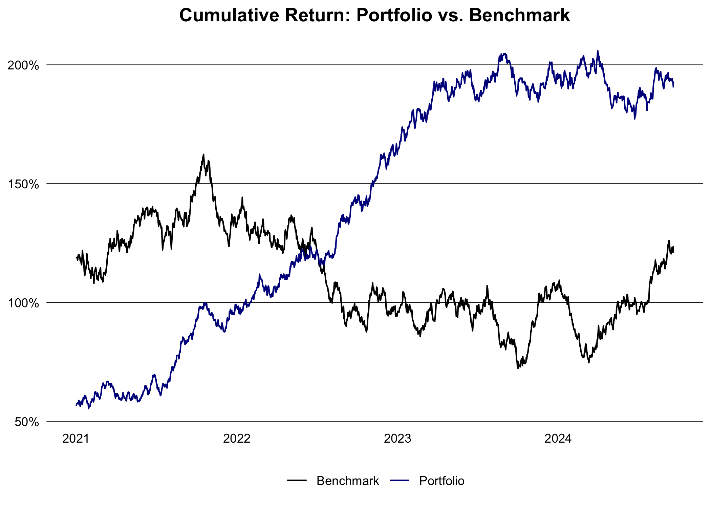
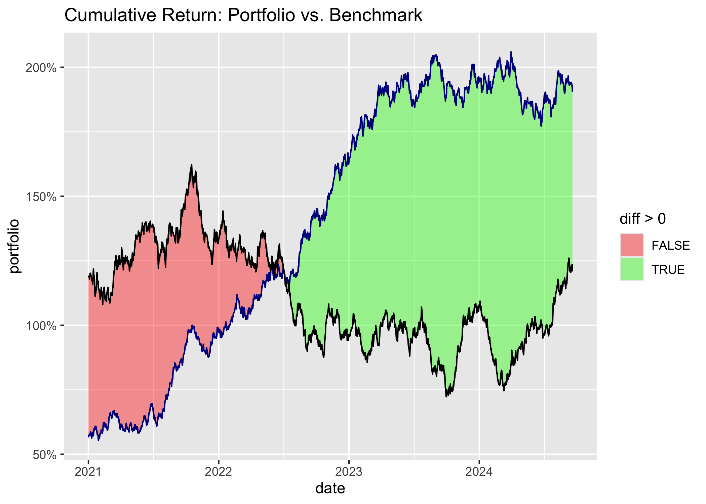

# data.table finance notes

The goal of this document is to document common financial calculations
using the `data.table` package using the latest `R >= 4.4` and
`data.table >= 1.16` syntax.

## Portfolio Management

#### Generate data

Generate some fake stock prices for a few tickers.

``` r
library(data.table)

set.seed(1994L)

generate_prices <- function(ticker, start_date, end_date) {
  dates <- seq.Date(as.Date(start_date), as.Date(end_date), by = "days")
  n <- length(dates)
  prices <- cumprod(1 + rnorm(n, mean = 0.0005, sd = 0.01)) * 100
  data.table(
    ticker = ticker,
    date = dates,
    price = prices
  )
}

generate_benchmark <- function(start_date, end_date) {
  dates <- seq.Date(as.Date(start_date), as.Date(end_date), by = "days")
  n <- length(dates)
  prices <- cumprod(1 + rnorm(n, mean = 0.0003, sd = 0.008)) * 3000
  data.table(
    ticker = "SP500",
    date = dates,
    price = prices
  )
}

ticker <- c("AAPL", "GOOGL", "MSFT", "AMZN")
start_date <- "2015-01-01"
end_date <- Sys.Date()

dt <- lapply(ticker, generate_prices, start_date, end_date) |> rbindlist()
weights <- data.table(
  ticker = ticker,
  weight = c(0.4, 0.3, 0.2, 0.1),
  country = c("USA", "USA", "USA", "USA")
)
dt <- dt[weights, on = "ticker"]
head(dt)
```

       ticker       date     price weight country
       <char>     <Date>     <num>  <num>  <char>
    1:   AAPL 2015-01-01  98.76269    0.4     USA
    2:   AAPL 2015-01-02  99.09730    0.4     USA
    3:   AAPL 2015-01-03 100.83187    0.4     USA
    4:   AAPL 2015-01-04 102.29253    0.4     USA
    5:   AAPL 2015-01-05 102.44505    0.4     USA
    6:   AAPL 2015-01-06 101.12377    0.4     USA

#### Calculate returns

``` r
dt <- dt |>
  setorder(ticker, date) |>
  _[, ret := price / shift(price) - 1, by = ticker] |>
  na.omit("ret") |>
  _[, wret := ret * weight]
head(dt)
```

       ticker       date    price weight country          ret          wret
       <char>     <Date>    <num>  <num>  <char>        <num>         <num>
    1:   AAPL 2015-01-02  99.0973    0.4     USA  0.003388113  0.0013552454
    2:   AAPL 2015-01-03 100.8319    0.4     USA  0.017503699  0.0070014795
    3:   AAPL 2015-01-04 102.2925    0.4     USA  0.014486079  0.0057944315
    4:   AAPL 2015-01-05 102.4451    0.4     USA  0.001491033  0.0005964132
    5:   AAPL 2015-01-06 101.1238    0.4     USA -0.012897486 -0.0051589943
    6:   AAPL 2015-01-07 101.9909    0.4     USA  0.008575100  0.0034300399

Alternatively, calculate the log returns:

``` r
logret <- function(x){
  x <- log(x)
  x - shift(x)
}

dt <- dt |>
  setorder(ticker, date) |>
  _[, ret := logret(price), by = ticker] |>
  na.omit("ret") |>
  _[, wret := ret * weight]
head(dt)
```

#### Calculate weekly, monthly and yearly returns

Return for each instrument:

``` r
dt[, let(week = week(date), month = month(date), year = year(date))]
ret_week <- dt[, .(ret = prod(1 + ret) - 1), by = .(ticker, year, week)]
ret_month <- dt[, .(ret = prod(1 + ret) - 1), by = .(ticker, year, month)]
ret_year <- dt[, .(ret = prod(1 + ret) - 1), by = .(ticker, year)]
head(ret_year)
```

       ticker  year         ret
       <char> <int>       <num>
    1:   AAPL  2015  0.16949691
    2:   AAPL  2016  0.13929434
    3:   AAPL  2017  0.05661279
    4:   AAPL  2018  0.21636018
    5:   AAPL  2019 -0.29360467
    6:   AAPL  2020  0.43077795

Return for the portfolio:

``` r
port_ret_week <- dt[, .(ret = prod(1 + wret) - 1), by = .(year, week)]
port_ret_month <- dt[, .(ret = prod(1 + wret) - 1), by = .(year, month)]
port_ret_year <- dt[, .(ret = prod(1 + wret) - 1), by = year]
head(port_ret_year)
```

        year         ret
       <int>       <num>
    1:  2015  0.17409548
    2:  2016  0.21111375
    3:  2017  0.13838336
    4:  2018  0.09718639
    5:  2019 -0.17371132
    6:  2020  0.05690970

#### Compare with benchmark

Calculat the benchmark return:

``` r
bmr <- generate_benchmark(start_date, end_date) |>
  setorder(date) |>
  _[, ret := price / shift(price) - 1] |>
  na.omit("ret")

port <- dt |>
  _[, .(ret = prod(1 + wret) - 1, ticker = "Portfolio"), by = date] |>
  rbind(bmr[, .(ticker, date, ret)]) |>
  setorder(ticker, date) |>
  _[, cum_ret := cumprod(1 + ret) - 1, by = ticker] |>
  _[, ticker := fifelse(ticker == "Portfolio", ticker, "Benchmark")]
```

Compare the portfolio with the benchmark performance:

``` r
library(ggplot2)

port |>
  _[between(date, "2021-01-01", max(date))] |>
  ggplot(aes(x = date, y = cum_ret, color = ticker)) +
  geom_line() +
  theme_minimal() +
  theme(
    plot.title = element_text(face = "bold", hjust = 0.5),
    panel.grid.major.y = element_line(color = "black", linewidth = 0.2),
    panel.grid.major.x = element_blank(),
    panel.grid.minor = element_blank(),
    axis.text = element_text(color = "black"),
    axis.title = element_blank(),
    legend.title = element_blank(),
    legend.position = "bottom"
  ) +
  scale_color_manual(values = c("Portfolio" = "darkblue", "Benchmark" = "black")) +
  scale_y_continuous(labels = scales::percent_format(accuracy = 2L)) +
  labs(title = "Cumulative Return: Portfolio vs. Benchmark")
```



Or turn it into a wide-format and display the performance as an area
chart:

``` r
# TODO: remove the legend with T/F and bmr/port labels
perf <- port |>
  dcast(date ~ ticker, value.var = "cum_ret") |>
  setnames(tolower) |>
  _[, diff := portfolio - benchmark]

perf |>
  _[between(date, "2021-01-01", max(date))] |>
  ggplot(aes(x = date)) +
  geom_ribbon(aes(
      ymin = pmin(portfolio, benchmark),
      ymax = pmax(portfolio, benchmark),
      fill = diff > 0
    ),
    alpha = 0.4
  ) +
  geom_line(aes(y = portfolio), color = "darkblue") +
  geom_line(aes(y = benchmark), color = "black") +
  scale_fill_manual(values = c("TRUE" = "green", "FALSE" = "red")) +
  scale_y_continuous(labels = scales::percent_format(accuracy = 2L)) +
  labs(title = "Cumulative Return: Portfolio vs. Benchmark")
```



``` r
  theme_minimal() +
  theme(
    plot.title = element_text(face = "bold", hjust = 0.5),
    panel.grid.major.y = element_line(color = "black", linewidth = 0.2),
    panel.grid.major.x = element_blank(),
    panel.grid.minor = element_blank(),
    axis.text = element_text(color = "black"),
    axis.title = element_blank(),
    legend.title = element_blank(),
    legend.position = "none"
  )
```

    List of 136
     $ line                            :List of 6
      ..$ colour       : chr "black"
      ..$ linewidth    : num 0.5
      ..$ linetype     : num 1
      ..$ lineend      : chr "butt"
      ..$ arrow        : logi FALSE
      ..$ inherit.blank: logi TRUE
      ..- attr(*, "class")= chr [1:2] "element_line" "element"
     $ rect                            :List of 5
      ..$ fill         : chr "white"
      ..$ colour       : chr "black"
      ..$ linewidth    : num 0.5
      ..$ linetype     : num 1
      ..$ inherit.blank: logi TRUE
      ..- attr(*, "class")= chr [1:2] "element_rect" "element"
     $ text                            :List of 11
      ..$ family       : chr ""
      ..$ face         : chr "plain"
      ..$ colour       : chr "black"
      ..$ size         : num 11
      ..$ hjust        : num 0.5
      ..$ vjust        : num 0.5
      ..$ angle        : num 0
      ..$ lineheight   : num 0.9
      ..$ margin       : 'margin' num [1:4] 0points 0points 0points 0points
      .. ..- attr(*, "unit")= int 8
      ..$ debug        : logi FALSE
      ..$ inherit.blank: logi TRUE
      ..- attr(*, "class")= chr [1:2] "element_text" "element"
     $ title                           : NULL
     $ aspect.ratio                    : NULL
     $ axis.title                      : list()
      ..- attr(*, "class")= chr [1:2] "element_blank" "element"
     $ axis.title.x                    :List of 11
      ..$ family       : NULL
      ..$ face         : NULL
      ..$ colour       : NULL
      ..$ size         : NULL
      ..$ hjust        : NULL
      ..$ vjust        : num 1
      ..$ angle        : NULL
      ..$ lineheight   : NULL
      ..$ margin       : 'margin' num [1:4] 2.75points 0points 0points 0points
      .. ..- attr(*, "unit")= int 8
      ..$ debug        : NULL
      ..$ inherit.blank: logi TRUE
      ..- attr(*, "class")= chr [1:2] "element_text" "element"
     $ axis.title.x.top                :List of 11
      ..$ family       : NULL
      ..$ face         : NULL
      ..$ colour       : NULL
      ..$ size         : NULL
      ..$ hjust        : NULL
      ..$ vjust        : num 0
      ..$ angle        : NULL
      ..$ lineheight   : NULL
      ..$ margin       : 'margin' num [1:4] 0points 0points 2.75points 0points
      .. ..- attr(*, "unit")= int 8
      ..$ debug        : NULL
      ..$ inherit.blank: logi TRUE
      ..- attr(*, "class")= chr [1:2] "element_text" "element"
     $ axis.title.x.bottom             : NULL
     $ axis.title.y                    :List of 11
      ..$ family       : NULL
      ..$ face         : NULL
      ..$ colour       : NULL
      ..$ size         : NULL
      ..$ hjust        : NULL
      ..$ vjust        : num 1
      ..$ angle        : num 90
      ..$ lineheight   : NULL
      ..$ margin       : 'margin' num [1:4] 0points 2.75points 0points 0points
      .. ..- attr(*, "unit")= int 8
      ..$ debug        : NULL
      ..$ inherit.blank: logi TRUE
      ..- attr(*, "class")= chr [1:2] "element_text" "element"
     $ axis.title.y.left               : NULL
     $ axis.title.y.right              :List of 11
      ..$ family       : NULL
      ..$ face         : NULL
      ..$ colour       : NULL
      ..$ size         : NULL
      ..$ hjust        : NULL
      ..$ vjust        : num 1
      ..$ angle        : num -90
      ..$ lineheight   : NULL
      ..$ margin       : 'margin' num [1:4] 0points 0points 0points 2.75points
      .. ..- attr(*, "unit")= int 8
      ..$ debug        : NULL
      ..$ inherit.blank: logi TRUE
      ..- attr(*, "class")= chr [1:2] "element_text" "element"
     $ axis.text                       :List of 11
      ..$ family       : NULL
      ..$ face         : NULL
      ..$ colour       : chr "black"
      ..$ size         : 'rel' num 0.8
      ..$ hjust        : NULL
      ..$ vjust        : NULL
      ..$ angle        : NULL
      ..$ lineheight   : NULL
      ..$ margin       : NULL
      ..$ debug        : NULL
      ..$ inherit.blank: logi FALSE
      ..- attr(*, "class")= chr [1:2] "element_text" "element"
     $ axis.text.x                     :List of 11
      ..$ family       : NULL
      ..$ face         : NULL
      ..$ colour       : NULL
      ..$ size         : NULL
      ..$ hjust        : NULL
      ..$ vjust        : num 1
      ..$ angle        : NULL
      ..$ lineheight   : NULL
      ..$ margin       : 'margin' num [1:4] 2.2points 0points 0points 0points
      .. ..- attr(*, "unit")= int 8
      ..$ debug        : NULL
      ..$ inherit.blank: logi TRUE
      ..- attr(*, "class")= chr [1:2] "element_text" "element"
     $ axis.text.x.top                 :List of 11
      ..$ family       : NULL
      ..$ face         : NULL
      ..$ colour       : NULL
      ..$ size         : NULL
      ..$ hjust        : NULL
      ..$ vjust        : num 0
      ..$ angle        : NULL
      ..$ lineheight   : NULL
      ..$ margin       : 'margin' num [1:4] 0points 0points 2.2points 0points
      .. ..- attr(*, "unit")= int 8
      ..$ debug        : NULL
      ..$ inherit.blank: logi TRUE
      ..- attr(*, "class")= chr [1:2] "element_text" "element"
     $ axis.text.x.bottom              : NULL
     $ axis.text.y                     :List of 11
      ..$ family       : NULL
      ..$ face         : NULL
      ..$ colour       : NULL
      ..$ size         : NULL
      ..$ hjust        : num 1
      ..$ vjust        : NULL
      ..$ angle        : NULL
      ..$ lineheight   : NULL
      ..$ margin       : 'margin' num [1:4] 0points 2.2points 0points 0points
      .. ..- attr(*, "unit")= int 8
      ..$ debug        : NULL
      ..$ inherit.blank: logi TRUE
      ..- attr(*, "class")= chr [1:2] "element_text" "element"
     $ axis.text.y.left                : NULL
     $ axis.text.y.right               :List of 11
      ..$ family       : NULL
      ..$ face         : NULL
      ..$ colour       : NULL
      ..$ size         : NULL
      ..$ hjust        : num 0
      ..$ vjust        : NULL
      ..$ angle        : NULL
      ..$ lineheight   : NULL
      ..$ margin       : 'margin' num [1:4] 0points 0points 0points 2.2points
      .. ..- attr(*, "unit")= int 8
      ..$ debug        : NULL
      ..$ inherit.blank: logi TRUE
      ..- attr(*, "class")= chr [1:2] "element_text" "element"
     $ axis.text.theta                 : NULL
     $ axis.text.r                     :List of 11
      ..$ family       : NULL
      ..$ face         : NULL
      ..$ colour       : NULL
      ..$ size         : NULL
      ..$ hjust        : num 0.5
      ..$ vjust        : NULL
      ..$ angle        : NULL
      ..$ lineheight   : NULL
      ..$ margin       : 'margin' num [1:4] 0points 2.2points 0points 2.2points
      .. ..- attr(*, "unit")= int 8
      ..$ debug        : NULL
      ..$ inherit.blank: logi TRUE
      ..- attr(*, "class")= chr [1:2] "element_text" "element"
     $ axis.ticks                      : list()
      ..- attr(*, "class")= chr [1:2] "element_blank" "element"
     $ axis.ticks.x                    : NULL
     $ axis.ticks.x.top                : NULL
     $ axis.ticks.x.bottom             : NULL
     $ axis.ticks.y                    : NULL
     $ axis.ticks.y.left               : NULL
     $ axis.ticks.y.right              : NULL
     $ axis.ticks.theta                : NULL
     $ axis.ticks.r                    : NULL
     $ axis.minor.ticks.x.top          : NULL
     $ axis.minor.ticks.x.bottom       : NULL
     $ axis.minor.ticks.y.left         : NULL
     $ axis.minor.ticks.y.right        : NULL
     $ axis.minor.ticks.theta          : NULL
     $ axis.minor.ticks.r              : NULL
     $ axis.ticks.length               : 'simpleUnit' num 2.75points
      ..- attr(*, "unit")= int 8
     $ axis.ticks.length.x             : NULL
     $ axis.ticks.length.x.top         : NULL
     $ axis.ticks.length.x.bottom      : NULL
     $ axis.ticks.length.y             : NULL
     $ axis.ticks.length.y.left        : NULL
     $ axis.ticks.length.y.right       : NULL
     $ axis.ticks.length.theta         : NULL
     $ axis.ticks.length.r             : NULL
     $ axis.minor.ticks.length         : 'rel' num 0.75
     $ axis.minor.ticks.length.x       : NULL
     $ axis.minor.ticks.length.x.top   : NULL
     $ axis.minor.ticks.length.x.bottom: NULL
     $ axis.minor.ticks.length.y       : NULL
     $ axis.minor.ticks.length.y.left  : NULL
     $ axis.minor.ticks.length.y.right : NULL
     $ axis.minor.ticks.length.theta   : NULL
     $ axis.minor.ticks.length.r       : NULL
     $ axis.line                       : list()
      ..- attr(*, "class")= chr [1:2] "element_blank" "element"
     $ axis.line.x                     : NULL
     $ axis.line.x.top                 : NULL
     $ axis.line.x.bottom              : NULL
     $ axis.line.y                     : NULL
     $ axis.line.y.left                : NULL
     $ axis.line.y.right               : NULL
     $ axis.line.theta                 : NULL
     $ axis.line.r                     : NULL
     $ legend.background               : list()
      ..- attr(*, "class")= chr [1:2] "element_blank" "element"
     $ legend.margin                   : 'margin' num [1:4] 5.5points 5.5points 5.5points 5.5points
      ..- attr(*, "unit")= int 8
     $ legend.spacing                  : 'simpleUnit' num 11points
      ..- attr(*, "unit")= int 8
     $ legend.spacing.x                : NULL
     $ legend.spacing.y                : NULL
     $ legend.key                      : list()
      ..- attr(*, "class")= chr [1:2] "element_blank" "element"
     $ legend.key.size                 : 'simpleUnit' num 1.2lines
      ..- attr(*, "unit")= int 3
     $ legend.key.height               : NULL
     $ legend.key.width                : NULL
     $ legend.key.spacing              : 'simpleUnit' num 5.5points
      ..- attr(*, "unit")= int 8
     $ legend.key.spacing.x            : NULL
     $ legend.key.spacing.y            : NULL
     $ legend.frame                    : NULL
     $ legend.ticks                    : NULL
     $ legend.ticks.length             : 'rel' num 0.2
     $ legend.axis.line                : NULL
     $ legend.text                     :List of 11
      ..$ family       : NULL
      ..$ face         : NULL
      ..$ colour       : NULL
      ..$ size         : 'rel' num 0.8
      ..$ hjust        : NULL
      ..$ vjust        : NULL
      ..$ angle        : NULL
      ..$ lineheight   : NULL
      ..$ margin       : NULL
      ..$ debug        : NULL
      ..$ inherit.blank: logi TRUE
      ..- attr(*, "class")= chr [1:2] "element_text" "element"
     $ legend.text.position            : NULL
     $ legend.title                    : list()
      ..- attr(*, "class")= chr [1:2] "element_blank" "element"
     $ legend.title.position           : NULL
     $ legend.position                 : chr "none"
     $ legend.position.inside          : NULL
     $ legend.direction                : NULL
     $ legend.byrow                    : NULL
     $ legend.justification            : chr "center"
     $ legend.justification.top        : NULL
     $ legend.justification.bottom     : NULL
     $ legend.justification.left       : NULL
     $ legend.justification.right      : NULL
     $ legend.justification.inside     : NULL
     $ legend.location                 : NULL
     $ legend.box                      : NULL
     $ legend.box.just                 : NULL
     $ legend.box.margin               : 'margin' num [1:4] 0cm 0cm 0cm 0cm
      ..- attr(*, "unit")= int 1
     $ legend.box.background           : list()
      ..- attr(*, "class")= chr [1:2] "element_blank" "element"
     $ legend.box.spacing              : 'simpleUnit' num 11points
      ..- attr(*, "unit")= int 8
      [list output truncated]
     - attr(*, "class")= chr [1:2] "theme" "gg"
     - attr(*, "complete")= logi TRUE
     - attr(*, "validate")= logi TRUE

``` r
library(gt)

perf |>
  _[date >= "2022-01-10", .(
    benchmark = last(benchmark) - first(benchmark),
    portfolio = last(portfolio) - first(portfolio)
  ), by = .(year(date))] |>
  gt() |>
  fmt_markdown() |>
  tab_header(title = "Performance: Portfolio vs. Benchmark") |>
  fmt_percent(columns = c("benchmark", "portfolio")) |>
  cols_label(year = "Year", benchmark = "Benchmark", portfolio = "Portfolio")
```

#### Analyse the portfolio exposure

#### Calculate volatility

``` r
vola <- dt[, .(daily_vola = sd(ret)), by = .(ticker, year)] |>
  _[, let(
    weekly_vola = daily_vola * sqrt(5L),
    monthly_vola = daily_vola * sqrt(21L),
    yearly_vola = daily_vola * sqrt(252L)
  )]
head(vola)
```

       ticker  year  daily_vola weekly_vola monthly_vola yearly_vola
       <char> <int>       <num>       <num>        <num>       <num>
    1:   AAPL  2015 0.009842508  0.02200852   0.04510404   0.1562450
    2:   AAPL  2016 0.010360105  0.02316590   0.04747597   0.1644616
    3:   AAPL  2017 0.009606768  0.02148139   0.04402374   0.1525027
    4:   AAPL  2018 0.010042423  0.02245554   0.04602016   0.1594185
    5:   AAPL  2019 0.010333729  0.02310692   0.04735510   0.1640429
    6:   AAPL  2020 0.009252727  0.02068973   0.04240132   0.1468825

#### TODO:

- Max/average drawdown
- Tacking error
- Portfolio risk
