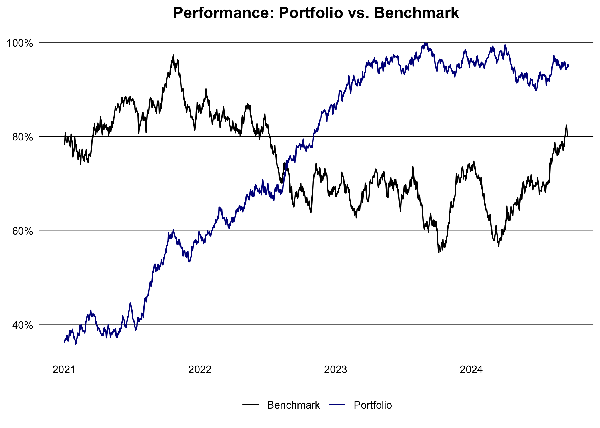

# data.table finance notes

The goal of this document is to document common financial calculations
using the `data.table` package using the latest `R >= 4.4` and
`data.table >= 1.16` syntax.

## Portfolio Management

#### Generate data

Generate some fake stock prices for a few tickers.

``` r
library(data.table)

set.seed(1994L)

generate_prices <- function(ticker, start_date, end_date) {
  dates <- seq.Date(as.Date(start_date), as.Date(end_date), by = "days")
  n <- length(dates)
  prices <- cumprod(1 + rnorm(n, mean = 0.0005, sd = 0.01)) * 100
  data.table(
    ticker = ticker,
    date = dates,
    price = prices
  )
}

generate_benchmark <- function(start_date, end_date) {
  dates <- seq.Date(as.Date(start_date), as.Date(end_date), by = "days")
  n <- length(dates)
  prices <- cumprod(1 + rnorm(n, mean = 0.0003, sd = 0.008)) * 3000
  data.table(
    ticker = "SP500",
    date = dates,
    price = prices
  )
}

ticker <- c("AAPL", "GOOGL", "MSFT", "AMZN")
start_date <- "2015-01-01"
end_date <- Sys.Date()

dt <- lapply(ticker, generate_prices, start_date, end_date) |> rbindlist()
weights <- data.table(
  ticker = ticker,
  weight = c(0.4, 0.3, 0.2, 0.1),
  country = c("USA", "USA", "USA", "USA")
)
dt <- dt[weights, on = "ticker"]
head(dt)
```

       ticker       date     price weight country
       <char>     <Date>     <num>  <num>  <char>
    1:   AAPL 2015-01-01  98.76269    0.4     USA
    2:   AAPL 2015-01-02  99.09730    0.4     USA
    3:   AAPL 2015-01-03 100.83187    0.4     USA
    4:   AAPL 2015-01-04 102.29253    0.4     USA
    5:   AAPL 2015-01-05 102.44505    0.4     USA
    6:   AAPL 2015-01-06 101.12377    0.4     USA

#### Calculate returns

In most use-cases and asset classes working with log returns is
preferred.

``` r
logret <- function(x){
  x <- log(x)
  x - shift(x)
}

dt <- dt |>
  setorder(ticker, date) |>
  _[, ret := logret(price), by = ticker] |>
  na.omit("ret") |>
  _[, wret := ret * weight]
head(dt)
```

       ticker       date    price weight country          ret         wret
       <char>     <Date>    <num>  <num>  <char>        <num>        <num>
    1:   AAPL 2015-01-02  99.0973    0.4     USA  0.003382387  0.001352955
    2:   AAPL 2015-01-03 100.8319    0.4     USA  0.017352273  0.006940909
    3:   AAPL 2015-01-04 102.2925    0.4     USA  0.014382158  0.005752863
    4:   AAPL 2015-01-05 102.4451    0.4     USA  0.001489923  0.000595969
    5:   AAPL 2015-01-06 101.1238    0.4     USA -0.012981380 -0.005192552
    6:   AAPL 2015-01-07 101.9909    0.4     USA  0.008538542  0.003415417

#### Calculate weekly, monthly and yearly returns

Return for each instrument:

``` r
dt[, let(week = week(date), month = month(date), year = year(date))]
ret_week <- dt[, .(ret = sum(ret)), by = .(ticker, year, week)]
ret_month <- dt[, .(ret = sum(ret)), by = .(ticker, year, month)]
ret_year <- dt[, .(ret = sum(ret)), by = .(ticker, year)]
head(ret_year)
```

       ticker  year         ret
       <char> <int>       <num>
    1:   AAPL  2015  0.15657366
    2:   AAPL  2016  0.13040908
    3:   AAPL  2017  0.05506831
    4:   AAPL  2018  0.19586294
    5:   AAPL  2019 -0.34758024
    6:   AAPL  2020  0.35821832

Return for the portfolio:

``` r
port_ret_week <- dt[, .(ret = sum(wret)), by = .(year, week)]
port_ret_month <- dt[, .(ret = sum(wret)), by = .(year, month)]
port_ret_year <- dt[, .(ret = sum(wret)), by = year]
head(port_ret_year)
```

        year         ret
       <int>       <num>
    1:  2015  0.14636114
    2:  2016  0.18143692
    3:  2017  0.11589234
    4:  2018  0.07554231
    5:  2019 -0.20145152
    6:  2020  0.03973387

#### Compare with benchmark

Calculat the benchmark return:

``` r
bmr <- generate_benchmark(start_date, end_date) |>
  setorder(date) |>
  _[, ret := logret(price)] |>
  na.omit("ret")

port <- dt |>
  _[, .(ret = sum(wret), ticker = "Portfolio"), by = date] |>
  rbind(bmr[, .(ticker, date, ret)]) |>
  setorder(ticker, date) |>
  _[, cum_ret := cumsum(ret), by = ticker] |>
  _[, ticker := fifelse(ticker == "Portfolio", ticker, "Benchmark")][]
```

Compare the portfolio with the benchmark performance:

``` r
library(ggplot2)

port |>
  _[between(date, "2021-01-01", max(date))] |>
  ggplot(aes(x = date, y = cum_ret, color = ticker)) +
  geom_line() +
  theme_minimal() +
  theme(
    plot.title = element_text(face = "bold", hjust = 0.5),
    panel.grid.major.y = element_line(color = "black", linewidth = 0.2),
    panel.grid.major.x = element_blank(),
    panel.grid.minor = element_blank(),
    axis.text = element_text(color = "black"),
    axis.title = element_blank(),
    legend.title = element_blank(),
    legend.position = "bottom"
  ) +
  scale_color_manual(values = c("Portfolio" = "darkblue", "Benchmark" = "black")) +
  scale_y_continuous(labels = scales::percent_format(accuracy = 2L)) +
  labs(title = "Performance: Portfolio vs. Benchmark")
```



Or turn it into a wide-format and display the performance as an area
chart:

``` r
# TODO: remove the legend with T/F and bmr/port labels
perf <- port |>
  dcast(date ~ ticker, value.var = "cum_ret") |>
  setnames(tolower) |>
  _[, diff := portfolio - benchmark][]

perf |>
  _[between(date, "2021-01-01", max(date))] |>
  ggplot(aes(x = date)) +
  geom_ribbon(aes(
      ymin = pmin(portfolio, benchmark),
      ymax = pmax(portfolio, benchmark),
      fill = diff > 0
    ),
    alpha = 0.4
  ) +
  geom_line(aes(y = portfolio), color = "darkblue") +
  geom_line(aes(y = benchmark), color = "black") +
  scale_fill_manual(values = c("TRUE" = "green", "FALSE" = "red")) +
  scale_y_continuous(labels = scales::percent_format(accuracy = 2L)) +
  labs(title = "Performance: Portfolio vs. Benchmark") +
  theme_minimal() +
  theme(
    plot.title = element_text(face = "bold", hjust = 0.5),
    panel.grid.major.y = element_line(color = "black", linewidth = 0.2),
    panel.grid.major.x = element_blank(),
    panel.grid.minor = element_blank(),
    axis.text = element_text(color = "black"),
    axis.title = element_blank(),
    legend.title = element_blank()
  )
```


``` r
library(gt)

perf |>
  _[date >= "2022-01-10", .(benchmark = last(benchmark) - first(benchmark), portfolio = last(portfolio) - first(portfolio)), by = .(year(date))] |>
  gt() |>
  tab_header(title = "Performance: Portfolio vs. Benchmark") |>
  fmt_percent(columns = c("benchmark", "portfolio")) |>
  cols_label(year = "Year", benchmark = "Benchmark", portfolio = "Portfolio")
```

<div id="mszhdufgcx" style="padding-left:0px;padding-right:0px;padding-top:10px;padding-bottom:10px;overflow-x:auto;overflow-y:auto;width:auto;height:auto;">
<style>#mszhdufgcx table {
  font-family: system-ui, 'Segoe UI', Roboto, Helvetica, Arial, sans-serif, 'Apple Color Emoji', 'Segoe UI Emoji', 'Segoe UI Symbol', 'Noto Color Emoji';
  -webkit-font-smoothing: antialiased;
  -moz-osx-font-smoothing: grayscale;
}
&#10;#mszhdufgcx thead, #mszhdufgcx tbody, #mszhdufgcx tfoot, #mszhdufgcx tr, #mszhdufgcx td, #mszhdufgcx th {
  border-style: none;
}
&#10;#mszhdufgcx p {
  margin: 0;
  padding: 0;
}
&#10;#mszhdufgcx .gt_table {
  display: table;
  border-collapse: collapse;
  line-height: normal;
  margin-left: auto;
  margin-right: auto;
  color: #333333;
  font-size: 16px;
  font-weight: normal;
  font-style: normal;
  background-color: #FFFFFF;
  width: auto;
  border-top-style: solid;
  border-top-width: 2px;
  border-top-color: #A8A8A8;
  border-right-style: none;
  border-right-width: 2px;
  border-right-color: #D3D3D3;
  border-bottom-style: solid;
  border-bottom-width: 2px;
  border-bottom-color: #A8A8A8;
  border-left-style: none;
  border-left-width: 2px;
  border-left-color: #D3D3D3;
}
&#10;#mszhdufgcx .gt_caption {
  padding-top: 4px;
  padding-bottom: 4px;
}
&#10;#mszhdufgcx .gt_title {
  color: #333333;
  font-size: 125%;
  font-weight: initial;
  padding-top: 4px;
  padding-bottom: 4px;
  padding-left: 5px;
  padding-right: 5px;
  border-bottom-color: #FFFFFF;
  border-bottom-width: 0;
}
&#10;#mszhdufgcx .gt_subtitle {
  color: #333333;
  font-size: 85%;
  font-weight: initial;
  padding-top: 3px;
  padding-bottom: 5px;
  padding-left: 5px;
  padding-right: 5px;
  border-top-color: #FFFFFF;
  border-top-width: 0;
}
&#10;#mszhdufgcx .gt_heading {
  background-color: #FFFFFF;
  text-align: center;
  border-bottom-color: #FFFFFF;
  border-left-style: none;
  border-left-width: 1px;
  border-left-color: #D3D3D3;
  border-right-style: none;
  border-right-width: 1px;
  border-right-color: #D3D3D3;
}
&#10;#mszhdufgcx .gt_bottom_border {
  border-bottom-style: solid;
  border-bottom-width: 2px;
  border-bottom-color: #D3D3D3;
}
&#10;#mszhdufgcx .gt_col_headings {
  border-top-style: solid;
  border-top-width: 2px;
  border-top-color: #D3D3D3;
  border-bottom-style: solid;
  border-bottom-width: 2px;
  border-bottom-color: #D3D3D3;
  border-left-style: none;
  border-left-width: 1px;
  border-left-color: #D3D3D3;
  border-right-style: none;
  border-right-width: 1px;
  border-right-color: #D3D3D3;
}
&#10;#mszhdufgcx .gt_col_heading {
  color: #333333;
  background-color: #FFFFFF;
  font-size: 100%;
  font-weight: normal;
  text-transform: inherit;
  border-left-style: none;
  border-left-width: 1px;
  border-left-color: #D3D3D3;
  border-right-style: none;
  border-right-width: 1px;
  border-right-color: #D3D3D3;
  vertical-align: bottom;
  padding-top: 5px;
  padding-bottom: 6px;
  padding-left: 5px;
  padding-right: 5px;
  overflow-x: hidden;
}
&#10;#mszhdufgcx .gt_column_spanner_outer {
  color: #333333;
  background-color: #FFFFFF;
  font-size: 100%;
  font-weight: normal;
  text-transform: inherit;
  padding-top: 0;
  padding-bottom: 0;
  padding-left: 4px;
  padding-right: 4px;
}
&#10;#mszhdufgcx .gt_column_spanner_outer:first-child {
  padding-left: 0;
}
&#10;#mszhdufgcx .gt_column_spanner_outer:last-child {
  padding-right: 0;
}
&#10;#mszhdufgcx .gt_column_spanner {
  border-bottom-style: solid;
  border-bottom-width: 2px;
  border-bottom-color: #D3D3D3;
  vertical-align: bottom;
  padding-top: 5px;
  padding-bottom: 5px;
  overflow-x: hidden;
  display: inline-block;
  width: 100%;
}
&#10;#mszhdufgcx .gt_spanner_row {
  border-bottom-style: hidden;
}
&#10;#mszhdufgcx .gt_group_heading {
  padding-top: 8px;
  padding-bottom: 8px;
  padding-left: 5px;
  padding-right: 5px;
  color: #333333;
  background-color: #FFFFFF;
  font-size: 100%;
  font-weight: initial;
  text-transform: inherit;
  border-top-style: solid;
  border-top-width: 2px;
  border-top-color: #D3D3D3;
  border-bottom-style: solid;
  border-bottom-width: 2px;
  border-bottom-color: #D3D3D3;
  border-left-style: none;
  border-left-width: 1px;
  border-left-color: #D3D3D3;
  border-right-style: none;
  border-right-width: 1px;
  border-right-color: #D3D3D3;
  vertical-align: middle;
  text-align: left;
}
&#10;#mszhdufgcx .gt_empty_group_heading {
  padding: 0.5px;
  color: #333333;
  background-color: #FFFFFF;
  font-size: 100%;
  font-weight: initial;
  border-top-style: solid;
  border-top-width: 2px;
  border-top-color: #D3D3D3;
  border-bottom-style: solid;
  border-bottom-width: 2px;
  border-bottom-color: #D3D3D3;
  vertical-align: middle;
}
&#10;#mszhdufgcx .gt_from_md > :first-child {
  margin-top: 0;
}
&#10;#mszhdufgcx .gt_from_md > :last-child {
  margin-bottom: 0;
}
&#10;#mszhdufgcx .gt_row {
  padding-top: 8px;
  padding-bottom: 8px;
  padding-left: 5px;
  padding-right: 5px;
  margin: 10px;
  border-top-style: solid;
  border-top-width: 1px;
  border-top-color: #D3D3D3;
  border-left-style: none;
  border-left-width: 1px;
  border-left-color: #D3D3D3;
  border-right-style: none;
  border-right-width: 1px;
  border-right-color: #D3D3D3;
  vertical-align: middle;
  overflow-x: hidden;
}
&#10;#mszhdufgcx .gt_stub {
  color: #333333;
  background-color: #FFFFFF;
  font-size: 100%;
  font-weight: initial;
  text-transform: inherit;
  border-right-style: solid;
  border-right-width: 2px;
  border-right-color: #D3D3D3;
  padding-left: 5px;
  padding-right: 5px;
}
&#10;#mszhdufgcx .gt_stub_row_group {
  color: #333333;
  background-color: #FFFFFF;
  font-size: 100%;
  font-weight: initial;
  text-transform: inherit;
  border-right-style: solid;
  border-right-width: 2px;
  border-right-color: #D3D3D3;
  padding-left: 5px;
  padding-right: 5px;
  vertical-align: top;
}
&#10;#mszhdufgcx .gt_row_group_first td {
  border-top-width: 2px;
}
&#10;#mszhdufgcx .gt_row_group_first th {
  border-top-width: 2px;
}
&#10;#mszhdufgcx .gt_summary_row {
  color: #333333;
  background-color: #FFFFFF;
  text-transform: inherit;
  padding-top: 8px;
  padding-bottom: 8px;
  padding-left: 5px;
  padding-right: 5px;
}
&#10;#mszhdufgcx .gt_first_summary_row {
  border-top-style: solid;
  border-top-color: #D3D3D3;
}
&#10;#mszhdufgcx .gt_first_summary_row.thick {
  border-top-width: 2px;
}
&#10;#mszhdufgcx .gt_last_summary_row {
  padding-top: 8px;
  padding-bottom: 8px;
  padding-left: 5px;
  padding-right: 5px;
  border-bottom-style: solid;
  border-bottom-width: 2px;
  border-bottom-color: #D3D3D3;
}
&#10;#mszhdufgcx .gt_grand_summary_row {
  color: #333333;
  background-color: #FFFFFF;
  text-transform: inherit;
  padding-top: 8px;
  padding-bottom: 8px;
  padding-left: 5px;
  padding-right: 5px;
}
&#10;#mszhdufgcx .gt_first_grand_summary_row {
  padding-top: 8px;
  padding-bottom: 8px;
  padding-left: 5px;
  padding-right: 5px;
  border-top-style: double;
  border-top-width: 6px;
  border-top-color: #D3D3D3;
}
&#10;#mszhdufgcx .gt_last_grand_summary_row_top {
  padding-top: 8px;
  padding-bottom: 8px;
  padding-left: 5px;
  padding-right: 5px;
  border-bottom-style: double;
  border-bottom-width: 6px;
  border-bottom-color: #D3D3D3;
}
&#10;#mszhdufgcx .gt_striped {
  background-color: rgba(128, 128, 128, 0.05);
}
&#10;#mszhdufgcx .gt_table_body {
  border-top-style: solid;
  border-top-width: 2px;
  border-top-color: #D3D3D3;
  border-bottom-style: solid;
  border-bottom-width: 2px;
  border-bottom-color: #D3D3D3;
}
&#10;#mszhdufgcx .gt_footnotes {
  color: #333333;
  background-color: #FFFFFF;
  border-bottom-style: none;
  border-bottom-width: 2px;
  border-bottom-color: #D3D3D3;
  border-left-style: none;
  border-left-width: 2px;
  border-left-color: #D3D3D3;
  border-right-style: none;
  border-right-width: 2px;
  border-right-color: #D3D3D3;
}
&#10;#mszhdufgcx .gt_footnote {
  margin: 0px;
  font-size: 90%;
  padding-top: 4px;
  padding-bottom: 4px;
  padding-left: 5px;
  padding-right: 5px;
}
&#10;#mszhdufgcx .gt_sourcenotes {
  color: #333333;
  background-color: #FFFFFF;
  border-bottom-style: none;
  border-bottom-width: 2px;
  border-bottom-color: #D3D3D3;
  border-left-style: none;
  border-left-width: 2px;
  border-left-color: #D3D3D3;
  border-right-style: none;
  border-right-width: 2px;
  border-right-color: #D3D3D3;
}
&#10;#mszhdufgcx .gt_sourcenote {
  font-size: 90%;
  padding-top: 4px;
  padding-bottom: 4px;
  padding-left: 5px;
  padding-right: 5px;
}
&#10;#mszhdufgcx .gt_left {
  text-align: left;
}
&#10;#mszhdufgcx .gt_center {
  text-align: center;
}
&#10;#mszhdufgcx .gt_right {
  text-align: right;
  font-variant-numeric: tabular-nums;
}
&#10;#mszhdufgcx .gt_font_normal {
  font-weight: normal;
}
&#10;#mszhdufgcx .gt_font_bold {
  font-weight: bold;
}
&#10;#mszhdufgcx .gt_font_italic {
  font-style: italic;
}
&#10;#mszhdufgcx .gt_super {
  font-size: 65%;
}
&#10;#mszhdufgcx .gt_footnote_marks {
  font-size: 75%;
  vertical-align: 0.4em;
  position: initial;
}
&#10;#mszhdufgcx .gt_asterisk {
  font-size: 100%;
  vertical-align: 0;
}
&#10;#mszhdufgcx .gt_indent_1 {
  text-indent: 5px;
}
&#10;#mszhdufgcx .gt_indent_2 {
  text-indent: 10px;
}
&#10;#mszhdufgcx .gt_indent_3 {
  text-indent: 15px;
}
&#10;#mszhdufgcx .gt_indent_4 {
  text-indent: 20px;
}
&#10;#mszhdufgcx .gt_indent_5 {
  text-indent: 25px;
}
&#10;#mszhdufgcx .katex-display {
  display: inline-flex !important;
  margin-bottom: 0.75em !important;
}
&#10;#mszhdufgcx div.Reactable > div.rt-table > div.rt-thead > div.rt-tr.rt-tr-group-header > div.rt-th-group:after {
  height: 0px !important;
}
</style>
<table class="gt_table" data-quarto-disable-processing="false" data-quarto-bootstrap="false">
  <thead>
    <tr class="gt_heading">
      <td colspan="3" class="gt_heading gt_title gt_font_normal gt_bottom_border" style>Performance: Portfolio vs. Benchmark</td>
    </tr>
    &#10;    <tr class="gt_col_headings">
      <th class="gt_col_heading gt_columns_bottom_border gt_right" rowspan="1" colspan="1" scope="col" id="Year">Year</th>
      <th class="gt_col_heading gt_columns_bottom_border gt_right" rowspan="1" colspan="1" scope="col" id="Benchmark">Benchmark</th>
      <th class="gt_col_heading gt_columns_bottom_border gt_right" rowspan="1" colspan="1" scope="col" id="Portfolio">Portfolio</th>
    </tr>
  </thead>
  <tbody class="gt_table_body">
    <tr><td headers="year" class="gt_row gt_right">2022</td>
<td headers="benchmark" class="gt_row gt_right">−19.93%</td>
<td headers="portfolio" class="gt_row gt_right">28.96%</td></tr>
    <tr><td headers="year" class="gt_row gt_right">2023</td>
<td headers="benchmark" class="gt_row gt_right">5.42%</td>
<td headers="portfolio" class="gt_row gt_right">10.70%</td></tr>
    <tr><td headers="year" class="gt_row gt_right">2024</td>
<td headers="benchmark" class="gt_row gt_right">6.19%</td>
<td headers="portfolio" class="gt_row gt_right">−1.31%</td></tr>
  </tbody>
  &#10;  
</table>
</div>

#### Analyse the portfolio exposure

#### Calculate volatility

``` r
vola <- dt[, .(daily_vola = sd(ret)), by = .(ticker, year)] |>
  _[, let(
    weekly_vola = daily_vola * sqrt(5L),
    monthly_vola = daily_vola * sqrt(21L),
    yearly_vola = daily_vola * sqrt(252L)
  )]
head(vola)
```

       ticker  year  daily_vola weekly_vola monthly_vola yearly_vola
       <char> <int>       <num>       <num>        <num>       <num>
    1:   AAPL  2015 0.009838597  0.02199977   0.04508612   0.1561829
    2:   AAPL  2016 0.010356613  0.02315809   0.04745996   0.1644061
    3:   AAPL  2017 0.009602949  0.02147285   0.04400624   0.1524421
    4:   AAPL  2018 0.010043538  0.02245803   0.04602527   0.1594362
    5:   AAPL  2019 0.010341000  0.02312318   0.04738842   0.1641583
    6:   AAPL  2020 0.009245012  0.02067247   0.04236597   0.1467600

#### TODO:

- Max/average drawdown
- Tacking error
- Portfolio risk
