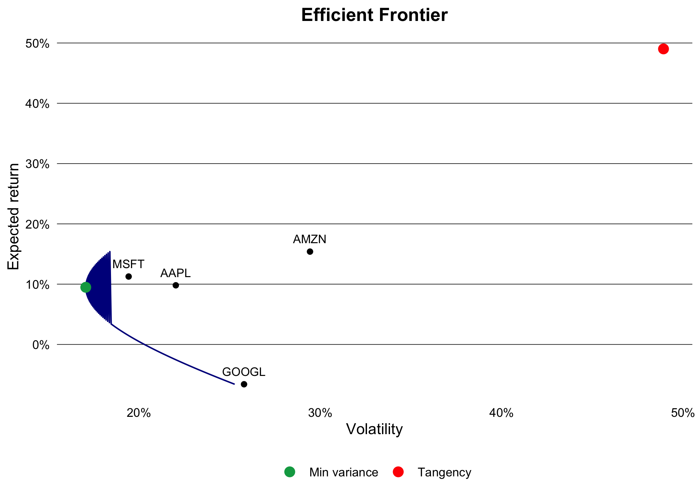

# Finance with {data.table}


- [Portfolio Management](#portfolio-management)
  - [Generate data](#generate-data)
  - [Holdings](#holdings)
  - [Portfolio Composition](#portfolio-composition)
  - [Calculate returns](#calculate-returns)
  - [Calculate weekly, monthly and yearly
    returns](#calculate-weekly-monthly-and-yearly-returns)
  - [Monthly return heatmap](#monthly-return-heatmap)
  - [Compare performance with a
    benchmark](#compare-performance-with-a-benchmark)
  - [Analyse the portfolio exposure](#analyse-the-portfolio-exposure)
  - [Calculate volatility](#calculate-volatility)
  - [Rolling volatility](#rolling-volatility)
  - [Sharpe ratio](#sharpe-ratio)
  - [Sortino ratio](#sortino-ratio)
  - [Rolling Sharpe](#rolling-sharpe)
  - [Value at Risk](#value-at-risk)
  - [Expected Shortfall (CVaR)](#expected-shortfall-cvar)
  - [Portfolio risk](#portfolio-risk)
  - [Drawdown](#drawdown)
  - [Calmar ratio](#calmar-ratio)
  - [Tracking error](#tracking-error)
  - [Information ratio](#information-ratio)
  - [Beta and Alpha](#beta-and-alpha)
  - [Multi-factor model](#multi-factor-model)
  - [Rolling market beta](#rolling-market-beta)
  - [Correlation matrix](#correlation-matrix)
- [Portfolio optimization](#portfolio-optimization)
  - [Expected returns and annualized
    covariance](#expected-returns-and-annualized-covariance)
  - [Minimum-variance portfolio](#minimum-variance-portfolio)
  - [Maximum-Sharpe (tangency)
    portfolio](#maximum-sharpe-tangency-portfolio)
  - [Compare the weights](#compare-the-weights)
  - [Efficient frontier](#efficient-frontier)

Just a place to store some code snippets and notes on finance with using
the latest `data.table` package. Requires `data.table >= 1.18.0`.

Load the required libraries:

``` r
library(clock)
library(data.table)
library(ggplot2)

theme_finance = theme_minimal() +
  theme(
    plot.title = element_text(face = "bold", hjust = 0.5),
    panel.grid.major.y = element_line(color = "black", linewidth = 0.2),
    panel.grid.major.x = element_blank(),
    panel.grid.minor = element_blank(),
    axis.text = element_text(color = "black"),
    axis.title = element_blank(),
    legend.title = element_blank()
  )
```

## Portfolio Management

#### Generate data

Generate some fake stock prices for a few tickers.

``` r
set.seed(1994)

start_date = "2015-01-01"
end_date = Sys.Date()
dates = seq(as.Date(start_date), end_date, by = "1 day")
n = length(dates)

market_ret = rnorm(n, mean = 0.0003, sd = 0.008)
sector_ret = list(
  technology = rnorm(n, mean = 0, sd = 0.004),
  consumer_cyclical = rnorm(n, mean = 0, sd = 0.005)
)

alloc = data.table(
  ticker = c("AAPL", "GOOGL", "MSFT", "AMZN"),
  weight = c(0.4, 0.3, 0.2, 0.1),
  sector = c("technology", "technology", "technology", "consumer_cyclical"),
  country = c("USA", "USA", "USA", "USA"),
  alpha = c(0.0004, 0.0002, 0.0003, 0.0001),
  beta = c(1.1, 1.3, 0.9, 1.4),
  idio_sd = c(0.010, 0.012, 0.009, 0.014)
)

generate_prices = function(alpha, beta, sector, idio_sd) {
  ret = alpha + beta * market_ret + sector_ret[[sector]] + rnorm(n, sd = idio_sd)
  data.table(date = dates, price = cumprod(1 + ret) * 100)
}

generate_benchmark = function() {
  data.table(ticker = "SP500", date = dates, price = cumprod(1 + market_ret) * 3000)
}

dt = alloc |>
  _[, generate_prices(alpha, beta, sector, idio_sd), by = ticker] |>
  _[alloc[, .(ticker, weight, sector, country)], on = "ticker"]
head(dt)
```

       ticker       date     price weight     sector country
       <char>     <Date>     <num>  <num>     <char>  <char>
    1:   AAPL 2015-01-01 100.20003    0.4 technology     USA
    2:   AAPL 2015-01-02 101.63723    0.4 technology     USA
    3:   AAPL 2015-01-03 102.37119    0.4 technology     USA
    4:   AAPL 2015-01-04 101.93654    0.4 technology     USA
    5:   AAPL 2015-01-05  99.96958    0.4 technology     USA
    6:   AAPL 2015-01-06  99.63687    0.4 technology     USA

#### Holdings

``` r
holdings = dt |>
  _[,
    .(start_price = first(price), current_price = last(price), weight = first(weight)),
    by = ticker
  ] |>
  _[, let(
    value = current_price * weight,
    abs_change = current_price - start_price,
    rel_change = current_price / start_price - 1
  )] |>
  _[, rel_weight := value / sum(value)]
head(holdings)
```

       ticker start_price current_price weight      value abs_change rel_change
       <char>       <num>         <num>  <num>      <num>      <num>      <num>
    1:   AAPL   100.20003     511.14640    0.4 204.458558  410.94637  4.1012601
    2:  GOOGL    97.29628      32.50979    0.3   9.752937  -64.78649 -0.6658681
    3:   MSFT    98.42555     639.35478    0.2 127.870956  540.92923  5.4958211
    4:   AMZN   101.00698    1303.31648    0.1 130.331648 1202.30950 11.9032319
       rel_weight
            <num>
    1: 0.43279521
    2: 0.02064489
    3: 0.27067557
    4: 0.27588433

#### Portfolio Composition

``` r
ggplot(holdings, aes(x = "", y = rel_weight, fill = ticker)) +
  geom_col(width = 1) +
  coord_polar(theta = "y") +
  geom_text(
    aes(label = scales::percent(rel_weight, accuracy = 0.1)),
    position = position_stack(vjust = 0.5)
  ) +
  scale_fill_brewer(palette = "Set2") +
  labs(title = "Portfolio Composition") +
  theme_void() +
  theme(
    plot.title = element_text(face = "bold", hjust = 0.5),
    legend.title = element_blank()
  )
```


#### Calculate returns

``` r
logret = function(x) {
  x = log(x)
  x - shift(x)
}

dt = dt |>
  setorder(ticker, date) |>
  _[, let(ret = price / shift(price) - 1, log_ret = logret(price)), by = ticker] |>
  na.omit("ret") |>
  _[, let(wret = ret * weight, value = price * weight)]
head(dt)
```

       ticker       date     price weight     sector country          ret
       <char>     <Date>     <num>  <num>     <char>  <char>        <num>
    1:   AAPL 2015-01-02 101.63723    0.4 technology     USA  0.014343387
    2:   AAPL 2015-01-03 102.37119    0.4 technology     USA  0.007221286
    3:   AAPL 2015-01-04 101.93654    0.4 technology     USA -0.004245802
    4:   AAPL 2015-01-05  99.96958    0.4 technology     USA -0.019295871
    5:   AAPL 2015-01-06  99.63687    0.4 technology     USA -0.003328133
    6:   AAPL 2015-01-07 101.04586    0.4 technology     USA  0.014141210
            log_ret         wret    value
              <num>        <num>    <num>
    1:  0.014241493  0.005737355 40.65489
    2:  0.007195337  0.002888514 40.94847
    3: -0.004254841 -0.001698321 40.77462
    4: -0.019484467 -0.007718349 39.98783
    5: -0.003333684 -0.001331253 39.85475
    6:  0.014042155  0.005656484 40.41834

``` r
dt |>
  _[date >= add_months(end_date, -12L), .(value = sum(value)), by = date] |>
  ggplot(aes(x = date, y = value)) +
  geom_line() +
  theme_finance +
  labs(title = "Portfolio Value")
```


#### Calculate weekly, monthly and yearly returns

Return for each instrument:

``` r
ret_week = dt[, .(ret = prod(1 + ret) - 1), by = .(ticker, isoyear(date), isoweek(date))]
ret_month = dt[, .(ret = prod(1 + ret) - 1), by = .(ticker, yearmon(date))]
ret_year = dt[, .(ret = prod(1 + ret) - 1), by = .(ticker, year(date))]
head(ret_year)
```

       ticker  year         ret
       <char> <int>       <num>
    1:   AAPL  2015 -0.11266346
    2:   AAPL  2016  0.31978389
    3:   AAPL  2017 -0.07695052
    4:   AAPL  2018  0.30288148
    5:   AAPL  2019 -0.26794012
    6:   AAPL  2020  0.71334359

Return for the portfolio:

``` r
port_daily = dt[, .(ret = sum(wret)), by = date]
port_ret_week = port_daily[, .(ret = prod(1 + ret) - 1), by = .(isoyear(date), isoweek(date))]
port_ret_month = port_daily[, .(ret = prod(1 + ret) - 1), by = .(yearmon(date))]
port_ret_year = port_daily[, .(ret = prod(1 + ret) - 1), by = year(date)]
head(port_ret_year)
```

        year          ret
       <int>        <num>
    1:  2015 -0.081306803
    2:  2016  0.294949689
    3:  2017 -0.008636402
    4:  2018  0.101149544
    5:  2019 -0.317789003
    6:  2020  0.678771830

#### Monthly return heatmap

``` r
port_ret_month_dt = port_daily[,
  .(ret = prod(1 + ret) - 1),
  by = .(year = year(date), month = month(date))
]

ggplot(
  port_ret_month_dt,
  aes(x = fctr(month), y = fctr(year, rev = TRUE), fill = ret)
) +
  geom_tile() +
  geom_text(aes(label = scales::percent(ret, accuracy = 0.1)), size = 2.5) +
  scale_fill_gradient2(
    low = "#FF0000",
    mid = "white",
    high = "darkblue",
    midpoint = 0,
    labels = scales::label_percent()
  ) +
  scale_x_discrete(labels = month.abb) +
  labs(title = "Monthly Portfolio Returns") +
  theme_minimal() +
  theme(
    plot.title = element_text(face = "bold", hjust = 0.5),
    axis.title = element_blank(),
    panel.grid = element_blank(),
    legend.title = element_blank()
  )
```


#### Compare performance with a benchmark

Calculate the benchmark return:

``` r
bmr = generate_benchmark() |>
  setorder(date) |>
  _[, ret := price / shift(price) - 1] |>
  na.omit("ret")

port = dt |>
  _[, .(ret = sum(wret), ticker = "Portfolio"), by = date] |>
  rbind(bmr[, .(ticker, date, ret)]) |>
  setorder(ticker, date) |>
  _[, cum_ret := cumprod(1 + ret) - 1, by = ticker] |>
  _[, ticker := fifelse(ticker == "Portfolio", ticker, "Benchmark")]
```

Compare the portfolio with the benchmark performance:

``` r
port |>
  _[date > "2021-01-01"] |>
  ggplot(aes(x = date, y = cum_ret, color = ticker)) +
  geom_line() +
  theme_finance +
  theme(legend.position = "bottom") +
  scale_color_manual(values = c("Portfolio" = "darkblue", "Benchmark" = "black")) +
  scale_y_continuous(labels = scales::label_percent(accuracy = 1)) +
  labs(title = "Cumulative Return: Portfolio vs. Benchmark")
```


Or turn it into a wide-format and display the performance as an area
chart:

``` r
perf = port |>
  dcast(date ~ ticker, value.var = "cum_ret") |>
  setnames(tolower) |>
  _[, diff := portfolio - benchmark]

perf |>
  _[date > "2021-01-01"] |>
  ggplot(aes(x = date)) +
  geom_ribbon(
    aes(
      ymin = pmin(portfolio, benchmark),
      ymax = pmax(portfolio, benchmark),
      fill = diff > 0
    ),
    alpha = 0.4,
    show.legend = FALSE
  ) +
  geom_line(aes(y = portfolio, color = "Portfolio")) +
  geom_line(aes(y = benchmark, color = "Benchmark")) +
  scale_color_manual(values = c("Portfolio" = "darkblue", "Benchmark" = "black")) +
  scale_fill_manual(values = c("TRUE" = "#00A651", "FALSE" = "#FF0000")) +
  scale_y_continuous(labels = scales::label_percent(accuracy = 1L)) +
  labs(title = "Cumulative Return: Portfolio vs. Benchmark") +
  theme_finance +
  theme(legend.position = "bottom")
```


#### Analyse the portfolio exposure

``` r
exposure = dt |>
  _[, .(value = sum(value)), by = .(date, sector)] |>
  _[, weight := value / sum(value), by = date]
head(exposure)
```

             date     sector    value    weight
           <Date>     <char>    <num>     <num>
    1: 2015-01-02 technology 89.14575 0.8973786
    2: 2015-01-03 technology 91.10352 0.8995518
    3: 2015-01-04 technology 91.42264 0.8982982
    4: 2015-01-05 technology 90.20889 0.8957352
    5: 2015-01-06 technology 88.71346 0.8935313
    6: 2015-01-07 technology 89.43718 0.8953180

Exposure by sector over time:

``` r
exposure |>
  _[date >= add_months(end_date, -12L)] |>
  ggplot(aes(x = date, y = weight, fill = sector)) +
  geom_area() +
  scale_y_continuous(labels = scales::label_percent()) +
  scale_fill_brewer(palette = "Set2") +
  labs(title = "Portfolio Exposure") +
  theme_finance +
  theme(legend.position = "bottom")
```


#### Calculate volatility

Note this is scaling volatility by $\sqrt{h}$, which has some
shortcomings, see for example [Diebold et.al.
(1996)](https://www.sas.upenn.edu/~fdiebold/papers/paper18/dsi.pdf).

``` r
vola = dt |>
  _[, .(daily_vola = sd(log_ret)), by = .(ticker, year(date))] |>
  _[, let(
    weekly_vola = daily_vola * sqrt(5),
    monthly_vola = daily_vola * sqrt(21),
    yearly_vola = daily_vola * sqrt(252)
  )]
head(vola)
```

       ticker  year daily_vola weekly_vola monthly_vola yearly_vola
       <char> <int>      <num>       <num>        <num>       <num>
    1:   AAPL  2015 0.01448963  0.03239981   0.06639985   0.2300158
    2:   AAPL  2016 0.01439883  0.03219676   0.06598372   0.2285743
    3:   AAPL  2017 0.01346843  0.03011632   0.06172009   0.2138047
    4:   AAPL  2018 0.01392469  0.03113656   0.06381097   0.2210477
    5:   AAPL  2019 0.01389859  0.03107819   0.06369134   0.2206333
    6:   AAPL  2020 0.01318090  0.02947338   0.06040246   0.2092403

#### Rolling volatility

``` r
window = 63L # ~3 months
port_daily[, roll_vola := frollsd(ret, window) * sqrt(252)]

port_daily |>
  na.omit("roll_vola") |>
  ggplot(aes(x = date, y = roll_vola)) +
  geom_line() +
  scale_y_continuous(labels = scales::label_percent()) +
  labs(title = "Rolling Annualized Volatility (63-day)") +
  theme_finance
```


#### Sharpe ratio

The Sharpe ratio measures risk-adjusted return:

$$S = \frac{R_p - R_f}{\sigma_p}$$

``` r
rf = 0.04 / 252 # daily risk-free rate (assuming 4% annual)
sharpe = port_daily[, (mean(ret) - rf) / sd(ret) * sqrt(252)]
sharpe
```

    [1] 0.2487261

#### Sortino ratio

The Sortino ratio replaces total volatility with downside deviation:

$$So = \frac{R_p - R_f}{\sigma_d}$$

``` r
sortino = port_daily[, (mean(ret) - rf) / sqrt(mean(pmin(ret - rf, 0)^2)) * sqrt(252)]
sortino
```

    [1] 0.3564971

#### Rolling Sharpe

``` r
port_daily[, roll_sharpe := (frollmean(ret, window) - rf) / frollsd(ret, window) * sqrt(252)]

port_daily |>
  na.omit("roll_sharpe") |>
  ggplot(aes(x = date, y = roll_sharpe)) +
  geom_line() +
  geom_hline(yintercept = 0, linewidth = 0.3) +
  labs(title = "Rolling Sharpe Ratio (63-day)") +
  theme_finance
```


#### Value at Risk

Historical VaR at the 95% and 99% confidence levels:

``` r
port_daily[, .(VaR_95 = quantile(ret, 0.05), VaR_99 = quantile(ret, 0.01))]
```

            VaR_95     VaR_99
             <num>      <num>
    1: -0.01868494 -0.0265535

#### Expected Shortfall (CVaR)

Average loss beyond VaR:

``` r
port_daily[, .(
  CVaR_95 = mean(ret[ret <= quantile(ret, 0.05)]),
  CVaR_99 = mean(ret[ret <= quantile(ret, 0.01)])
)]
```

           CVaR_95     CVaR_99
             <num>       <num>
    1: -0.02332281 -0.02985456

#### Portfolio risk

Portfolio risk is defined as:

$$\sigma_p = \sqrt{w^T \Sigma w}$$

``` r
cov_mat = dt |>
  dcast(date ~ ticker, value.var = "log_ret") |>
  _[, date := NULL] |>
  cov(use = "pairwise.complete.obs")
wgt = alloc[colnames(cov_mat), weight, on = "ticker"]
port_risk = as.numeric(sqrt(t(wgt) %*% cov_mat %*% wgt))
port_risk
```

    [1] 0.01144124

#### Drawdown

Maximum Drawdown is defined as follows:

$$MDD = \max_{i \leq j} \left( \frac{V_i - V_j}{V_i} \right)$$

Instrument drawdown:

``` r
drawdown = copy(dt) |>
  _[, cum_ret := cumprod(1 + ret) - 1, by = ticker] |>
  _[, drawdown := (1 + cum_ret) / cummax(1 + cum_ret) - 1, by = ticker]
head(drawdown)
```

       ticker       date     price weight     sector country          ret
       <char>     <Date>     <num>  <num>     <char>  <char>        <num>
    1:   AAPL 2015-01-02 101.63723    0.4 technology     USA  0.014343387
    2:   AAPL 2015-01-03 102.37119    0.4 technology     USA  0.007221286
    3:   AAPL 2015-01-04 101.93654    0.4 technology     USA -0.004245802
    4:   AAPL 2015-01-05  99.96958    0.4 technology     USA -0.019295871
    5:   AAPL 2015-01-06  99.63687    0.4 technology     USA -0.003328133
    6:   AAPL 2015-01-07 101.04586    0.4 technology     USA  0.014141210
            log_ret         wret    value      cum_ret     drawdown
              <num>        <num>    <num>        <num>        <num>
    1:  0.014241493  0.005737355 40.65489  0.014343387  0.000000000
    2:  0.007195337  0.002888514 40.94847  0.021668250  0.000000000
    3: -0.004254841 -0.001698321 40.77462  0.017330449 -0.004245802
    4: -0.019484467 -0.007718349 39.98783 -0.002299828 -0.023459747
    5: -0.003333684 -0.001331253 39.85475 -0.005620307 -0.026709803
    6:  0.014042155  0.005656484 40.41834  0.008441424 -0.012946302

Portfolio drawdown:

``` r
drawdown = dt |>
  _[, .(wret = sum(wret)), by = date] |>
  _[, cum_ret := cumprod(1 + wret) - 1] |>
  _[, drawdown := (1 + cum_ret) / cummax(1 + cum_ret) - 1]
head(drawdown)
```

             date         wret     cum_ret    drawdown
           <Date>        <num>       <num>       <num>
    1: 2015-01-02  0.002751661 0.002751661  0.00000000
    2: 2015-01-03  0.019863289 0.022669607  0.00000000
    3: 2015-01-04  0.004941003 0.027722620  0.00000000
    4: 2015-01-05 -0.010517142 0.016913916 -0.01051714
    5: 2015-01-06 -0.014166359 0.002507948 -0.02453451
    6: 2015-01-07  0.006239343 0.008762938 -0.01844825

``` r
drawdown[drawdown < 0, .(min_drawdown = min(drawdown), avg_drawdown = mean(drawdown))]
```

       min_drawdown avg_drawdown
              <num>        <num>
    1:   -0.4286351   -0.1219406

#### Calmar ratio

Annualized return divided by maximum drawdown:

``` r
calmar = port_daily[, (mean(ret) * 252) / abs(drawdown[, min(drawdown)])]
calmar
```

    [1] 0.1987295

#### Tracking error

Tracking error measures how closely a portfolio follows its benchmark:

$$TE = \sqrt{\frac{1}{N-1} \sum_{i=1}^{N} (r_{p,i} - r_{b,i})^2}$$

``` r
te = dt |>
  _[, .(port_ret = sum(wret)), by = date] |>
  _[bmr[, .(date, bmr_ret = ret)], on = "date", nomatch = NULL] |>
  _[, diff := port_ret - bmr_ret]

te[, .(
  daily_te = sd(diff),
  annual_te = sd(diff) * sqrt(252)
)]
```

          daily_te annual_te
             <num>     <num>
    1: 0.006974048 0.1107096

#### Information ratio

Excess return per unit of tracking error:

``` r
te[, mean(diff) / sd(diff) * sqrt(252)]
```

    [1] 0.3125412

#### Beta and Alpha

Beta measures the portfolio’s sensitivity to the benchmark, Alpha the
excess return:

$$r_p = \alpha + \beta \cdot r_b + \epsilon$$

``` r
fit = te[, lm(port_ret ~ bmr_ret)]
coefs = coef(fit)
data.table(alpha = coefs[1L] * 252, beta = coefs[2L])
```

           alpha     beta
           <num>    <num>
    1: 0.0275234 1.139932

#### Multi-factor model

The single-factor model above explains returns with the benchmark alone.
Each instrument is in fact driven by a common market factor plus a
sector factor, so we can regress every ticker on both and recover its
factor loadings. Assemble the factors and reshape them to long form,
then match each ticker to its own sector factor with a join on `date`
and `sector`:

``` r
factors = data.table(
  date = dates,
  mkt = market_ret,
  technology = sector_ret$technology,
  consumer_cyclical = sector_ret$consumer_cyclical
) |>
  melt(id.vars = c("date", "mkt"), variable.name = "sector", value.name = "sec_ret") |>
  _[, sector := as.character(sector)]

reg = factors[dt, on = .(date, sector), nomatch = NULL]
```

Run one regression per ticker and compare the recovered market beta with
the value that was used to generate the data:

``` r
loadings = reg[, as.list(coef(lm(ret ~ mkt + sec_ret))), by = ticker] |>
  setnames(c("ticker", "alpha", "mkt_beta", "sector_beta")) |>
  _[, alpha := alpha * 252]
loadings[alloc, on = "ticker", true_beta := i.beta]
loadings
```

       ticker       alpha  mkt_beta sector_beta true_beta
       <char>       <num>     <num>       <num>     <num>
    1:   AAPL  0.10249281 1.0899542   1.0004051       1.1
    2:   AMZN  0.12256292 1.3555510   1.0521381       1.4
    3:  GOOGL -0.06059036 1.2859670   1.0571820       1.3
    4:   MSFT  0.11965296 0.9150376   0.9760126       0.9

#### Rolling market beta

Beta is not static. Estimate it over a rolling window from the ratio of
the rolling covariance with the market to the market variance:

``` r
reg |>
  setorder(ticker, date) |>
  _[,
    let(
      cov_rm = frollmean(ret * mkt, window) - frollmean(ret, window) * frollmean(mkt, window),
      var_m = frollmean(mkt^2, window) - frollmean(mkt, window)^2
    ),
    by = ticker
  ] |>
  _[, roll_beta := cov_rm / var_m] |>
  na.omit("roll_beta") |>
  ggplot(aes(x = date, y = roll_beta, color = ticker)) +
  geom_line() +
  scale_color_brewer(palette = "Set2") +
  labs(title = "Rolling Market Beta (63-day)") +
  theme_finance +
  theme(legend.position = "bottom")
```


#### Correlation matrix

``` r
cor_mat = dt |>
  dcast(date ~ ticker, value.var = "log_ret") |>
  _[, date := NULL] |>
  cor(use = "pairwise.complete.obs")
round(cor_mat, 3)
```

           AAPL  AMZN GOOGL  MSFT
    AAPL  1.000 0.383 0.479 0.455
    AMZN  0.383 1.000 0.370 0.345
    GOOGL 0.479 0.370 1.000 0.458
    MSFT  0.455 0.345 0.458 1.000

``` r
cor_dt = as.data.table(cor_mat, keep.rownames = "ticker1") |>
  melt(id.vars = "ticker1", variable.name = "ticker2", value.name = "cor")

ggplot(cor_dt, aes(x = ticker1, y = ticker2, fill = cor)) +
  geom_tile() +
  geom_text(aes(label = round(cor, 2)), size = 3) +
  scale_fill_gradient2(low = "#FF0000", mid = "white", high = "darkblue", midpoint = 0) +
  labs(title = "Correlation Matrix") +
  theme_minimal() +
  theme(
    plot.title = element_text(face = "bold", hjust = 0.5),
    axis.title = element_blank(),
    panel.grid = element_blank()
  )
```


## Portfolio optimization

The covariance matrix from the *Portfolio risk* section, together with
the expected return of each instrument, is everything we need to find
optimal weights. The closed-form solutions below are *unconstrained*, so
weights may turn negative (short positions); adding a long-only
constraint would require a quadratic-programming solver.

#### Expected returns and annualized covariance

Use the mean `log_ret` per ticker for the expected returns, consistent
with the log-return covariance, and annualize both. Align the return
vector to the columns of `cov_mat` with the same join idiom used earlier
for the weights:

``` r
sigma = cov_mat * 252
mu = dt[, .(mu = mean(log_ret) * 252), by = ticker]
mu_vec = mu[colnames(sigma), mu, on = "ticker"]

prec = solve(sigma) # inverse covariance (precision) matrix
ones = rep(1, nrow(sigma))

port_stats = function(w) {
  list(ret = as.numeric(t(w) %*% mu_vec), vol = as.numeric(sqrt(t(w) %*% sigma %*% w)))
}
```

#### Minimum-variance portfolio

The portfolio with the lowest possible variance has a closed-form
solution:

$$w_{mv} = \frac{\Sigma^{-1} \mathbf{1}}{\mathbf{1}^{\top} \Sigma^{-1} \mathbf{1}}$$

``` r
w_mv = prec %*% ones / as.numeric(t(ones) %*% prec %*% ones)
mv = port_stats(w_mv)
mv
```

    $ret
    [1] 0.09480946

    $vol
    [1] 0.1706549

#### Maximum-Sharpe (tangency) portfolio

The tangency portfolio maximises the Sharpe ratio and points where the
capital market line touches the efficient frontier:

$$w_{tan} \propto \Sigma^{-1} (\mu - r_f \mathbf{1})$$

``` r
rf_ann = rf * 252
w_tan = prec %*% (mu_vec - rf_ann)
w_tan = w_tan / sum(w_tan)
tan = port_stats(w_tan)
c(tan, sharpe = (tan$ret - rf_ann) / tan$vol)
```

    $ret
    [1] 0.4902133

    $vol
    [1] 0.4891028

    $sharpe
    [1] 0.9204882

#### Compare the weights

``` r
weights = data.table(
  ticker = colnames(sigma),
  current = alloc[colnames(sigma), weight, on = "ticker"],
  min_var = as.numeric(w_mv),
  tangency = as.numeric(w_tan)
)
weights
```

       ticker current   min_var   tangency
       <char>   <num>     <num>      <num>
    1:   AAPL     0.4 0.2857577  0.7746624
    2:   AMZN     0.1 0.1058794  0.8009324
    3:  GOOGL     0.3 0.1011843 -1.9907817
    4:   MSFT     0.2 0.5071786  1.4151869

#### Efficient frontier

Every frontier portfolio can be traced in closed form from three scalars
derived from $\Sigma^{-1}$, $\mu$ and $\mathbf{1}$:

$$\sigma_p^2(\mu_p) = \frac{A \mu_p^2 - 2 B \mu_p + C}{A C - B^2},
\quad A = \mathbf{1}^{\top} \Sigma^{-1} \mathbf{1},
\quad B = \mathbf{1}^{\top} \Sigma^{-1} \mu,
\quad C = \mu^{\top} \Sigma^{-1} \mu$$

``` r
A = as.numeric(t(ones) %*% prec %*% ones)
B = as.numeric(t(ones) %*% prec %*% mu_vec)
C = as.numeric(t(mu_vec) %*% prec %*% mu_vec)
D = A * C - B^2

frontier = data.table(ret = seq(min(mu_vec), max(mu_vec), length.out = 100L)) |>
  _[, vol := sqrt((A * ret^2 - 2 * B * ret + C) / D)]
head(frontier)
```

               ret       vol
             <num>     <num>
    1: -0.06600891 0.2527404
    2: -0.06378661 0.2508462
    3: -0.06156431 0.2489642
    4: -0.05934202 0.2470948
    5: -0.05711972 0.2452382
    6: -0.05489742 0.2433947

Plot the frontier together with the individual instruments and the two
optimal portfolios:

``` r
assets = data.table(ticker = colnames(sigma), ret = mu_vec, vol = sqrt(diag(sigma)))
specials = data.table(
  label = c("Min variance", "Tangency"),
  ret = c(mv$ret, tan$ret),
  vol = c(mv$vol, tan$vol)
)

ggplot(frontier, aes(x = vol, y = ret)) +
  geom_line(color = "darkblue") +
  geom_point(data = assets, color = "black") +
  geom_text(data = assets, aes(label = ticker), vjust = -1, size = 3) +
  geom_point(data = specials, aes(color = label), size = 3) +
  scale_x_continuous(labels = scales::label_percent()) +
  scale_y_continuous(labels = scales::label_percent()) +
  scale_color_manual(values = c("Min variance" = "#00A651", "Tangency" = "#FF0000")) +
  labs(title = "Efficient Frontier", x = "Volatility", y = "Expected return") +
  theme_finance +
  theme(axis.title = element_text(), legend.position = "bottom")
```


