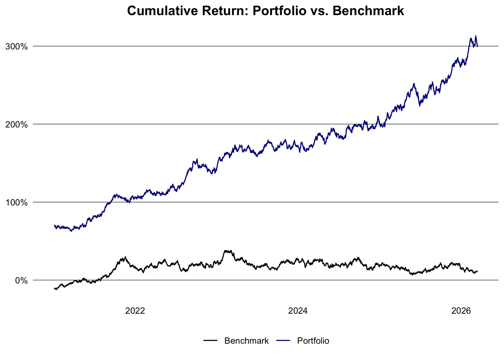

# Finance with {data.table}


Just a place to store some code snippets and notes on finance with using
the latest `data.table` package.

Load the required libraries:

``` r
library(clock)
library(data.table)
library(ggplot2)
```

## Portfolio Management

#### Generate data

Generate some fake stock prices for a few tickers.

``` r
set.seed(1994)

generate_prices <- function(ticker, start_date, end_date) {
  dates <- seq(as.Date(start_date), as.Date(end_date), by = "1 day")
  n <- length(dates)
  prices <- cumprod(1 + rnorm(n, mean = 0.0005, sd = 0.01)) * 100
  data.table(
    ticker = ticker,
    date = dates,
    price = prices
  )
}

generate_benchmark <- function(start_date, end_date) {
  dates <- seq(as.Date(start_date), as.Date(end_date), by = "1 day")
  n <- length(dates)
  prices <- cumprod(1 + rnorm(n, mean = 0.0003, sd = 0.008)) * 3000
  data.table(
    ticker = "SP500",
    date = dates,
    price = prices
  )
}

ticker <- c("AAPL", "GOOGL", "MSFT", "AMZN")
start_date <- "2015-01-01"
end_date <- Sys.Date()

dt <- rbindlist(lapply(ticker, generate_prices, start_date, end_date))
alloc <- data.table(
  ticker = ticker,
  weight = c(0.4, 0.3, 0.2, 0.1),
  sector = c("Technology", "Technology", "Technology", "Consumer Cyclical"),
  country = c("USA", "USA", "USA", "USA")
)
dt <- dt[alloc, on = "ticker"]
head(dt)
```

       ticker       date     price weight     sector country
       <char>     <Date>     <num>  <num>     <char>  <char>
    1:   AAPL 2015-01-01  98.76269    0.4 Technology     USA
    2:   AAPL 2015-01-02  99.09730    0.4 Technology     USA
    3:   AAPL 2015-01-03 100.83187    0.4 Technology     USA
    4:   AAPL 2015-01-04 102.29253    0.4 Technology     USA
    5:   AAPL 2015-01-05 102.44505    0.4 Technology     USA
    6:   AAPL 2015-01-06 101.12377    0.4 Technology     USA

#### Holdings

``` r
holdings <- dt |>
  _[,
    .(start_price = first(price), current_price = last(price), weight = first(weight)),
    by = ticker
  ] |>
  _[, let(
    value = current_price * weight,
    abs_change = current_price - start_price,
    rel_change = current_price / start_price - 1
  )] |>
  _[, rel_weight := value / sum(value)]
holdings
```

#### Portfolio Composition

``` r
ggplot(holdings, aes(x = "", y = rel_weight, fill = ticker)) +
  geom_col(width = 1) +
  coord_polar(theta = "y") +
  geom_text(
    aes(label = scales::percent(rel_weight, accuracy = 0.1)),
    position = position_stack(vjust = 0.5)
  ) +
  scale_fill_brewer(palette = "Set2") +
  labs(title = "Portfolio Composition") +
  theme_void() +
  theme(
    plot.title = element_text(face = "bold", hjust = 0.5),
    legend.title = element_blank()
  )
```


#### Calculate returns

``` r
logret <- function(x) {
  x <- log(x)
  x - shift(x)
}

dt <- dt |>
  setorder(ticker, date) |>
  _[, let(ret = price / shift(price) - 1, log_ret = logret(price)), by = ticker] |>
  na.omit("ret") |>
  _[, let(wret = ret * weight, value = price * weight)]
head(dt)
```

       ticker       date    price weight     sector country          ret
       <char>     <Date>    <num>  <num>     <char>  <char>        <num>
    1:   AAPL 2015-01-02  99.0973    0.4 Technology     USA  0.003388113
    2:   AAPL 2015-01-03 100.8319    0.4 Technology     USA  0.017503699
    3:   AAPL 2015-01-04 102.2925    0.4 Technology     USA  0.014486079
    4:   AAPL 2015-01-05 102.4451    0.4 Technology     USA  0.001491033
    5:   AAPL 2015-01-06 101.1238    0.4 Technology     USA -0.012897486
    6:   AAPL 2015-01-07 101.9909    0.4 Technology     USA  0.008575100
            log_ret          wret    value
              <num>         <num>    <num>
    1:  0.003382387  0.0013552454 39.63892
    2:  0.017352273  0.0070014795 40.33275
    3:  0.014382158  0.0057944315 40.91701
    4:  0.001489923  0.0005964132 40.97802
    5: -0.012981380 -0.0051589943 40.44951
    6:  0.008538542  0.0034300399 40.79637

``` r
dt |>
  _[date >= add_months(end_date, -12L), .(value = sum(value)), by = date] |>
  ggplot(aes(x = date, y = value)) +
  geom_line() +
  theme_minimal() +
  theme(
    plot.title = element_text(face = "bold", hjust = 0.5),
    panel.grid.major.y = element_line(color = "black", linewidth = 0.2),
    panel.grid.major.x = element_blank(),
    panel.grid.minor = element_blank(),
    axis.text = element_text(color = "black"),
    axis.title = element_blank()
  ) +
  labs(title = "Portfolio Value")
```


#### Calculate weekly, monthly and yearly returns

Return for each instrument:

``` r
ret_week <- dt[, .(ret = prod(1 + ret) - 1), by = .(ticker, year(date), week(date))]
```

    Warning in convertDate(as.IDate(x), "week"): The default behavior of week() is
    changing. Previously ('legacy' mode), week numbers advanced every 7th day of
    the year. The new 'sequential' mode ensures the first week always has 7 days.
    For example, as.IDate('2023-01-07') returns week 2 in legacy mode but week 1 in
    sequential mode (week 2 starts on '2023-01-08'). To adopt the new behavior now,
    set options(datatable.week = 'sequential'). To keep the old results and silence
    this warning, set options(datatable.week = 'legacy'). See
    https://github.com/Rdatatable/data.table/issues/2611

``` r
ret_month <- dt[, .(ret = prod(1 + ret) - 1), by = .(ticker, yearmon(date))]
ret_year <- dt[, .(ret = prod(1 + ret) - 1), by = .(ticker, year(date))]
head(ret_year)
```

       ticker  year         ret
       <char> <int>       <num>
    1:   AAPL  2015  0.16949691
    2:   AAPL  2016  0.13929434
    3:   AAPL  2017  0.05661279
    4:   AAPL  2018  0.21636018
    5:   AAPL  2019 -0.29360467
    6:   AAPL  2020  0.43077795

Return for the portfolio:

``` r
port_ret_week <- dt[, .(ret = prod(1 + wret) - 1), by = .(year(date), week(date))]
```

    Warning in convertDate(as.IDate(x), "week"): The default behavior of week() is
    changing. Previously ('legacy' mode), week numbers advanced every 7th day of
    the year. The new 'sequential' mode ensures the first week always has 7 days.
    For example, as.IDate('2023-01-07') returns week 2 in legacy mode but week 1 in
    sequential mode (week 2 starts on '2023-01-08'). To adopt the new behavior now,
    set options(datatable.week = 'sequential'). To keep the old results and silence
    this warning, set options(datatable.week = 'legacy'). See
    https://github.com/Rdatatable/data.table/issues/2611

``` r
port_ret_month <- dt[, .(ret = prod(1 + wret) - 1), by = .(yearmon(date))]
port_ret_year <- dt[, .(ret = prod(1 + wret) - 1), by = year(date)]
head(port_ret_year)
```

        year         ret
       <int>       <num>
    1:  2015  0.15224301
    2:  2016  0.12524341
    3:  2017 -0.04403318
    4:  2018  0.05218443
    5:  2019 -0.05218269
    6:  2020  0.36994989

#### Compare performance with a benchmark

Calculat the benchmark return:

``` r
bmr <- generate_benchmark(start_date, end_date) |>
  setorder(date) |>
  _[, ret := price / shift(price) - 1] |>
  na.omit("ret")

port <- dt |>
  _[, .(ret = prod(1 + wret) - 1, ticker = "Portfolio"), by = date] |>
  rbind(bmr[, .(ticker, date, ret)]) |>
  setorder(ticker, date) |>
  _[, cum_ret := cumprod(1 + ret) - 1, by = ticker] |>
  _[, ticker := replace(ticker, ticker != "Portfolio", "Benchmark")]
```

Compare the portfolio with the benchmark performance:

``` r
port |>
  _[date > "2021-01-01"] |>
  ggplot(aes(x = date, y = cum_ret, color = ticker)) +
  geom_line() +
  theme_minimal() +
  theme(
    plot.title = element_text(face = "bold", hjust = 0.5),
    panel.grid.major.y = element_line(color = "black", linewidth = 0.2),
    panel.grid.major.x = element_blank(),
    panel.grid.minor = element_blank(),
    axis.text = element_text(color = "black"),
    axis.title = element_blank(),
    legend.title = element_blank(),
    legend.position = "bottom"
  ) +
  scale_color_manual(values = c("Portfolio" = "darkblue", "Benchmark" = "black")) +
  scale_y_continuous(labels = scales::percent_format(accuracy = 2)) +
  labs(title = "Cumulative Return: Portfolio vs. Benchmark")
```



Or turn it into a wide-format and display the performance as an area
chart:

``` r
perf <- port |>
  dcast(date ~ ticker, value.var = "cum_ret") |>
  setnames(tolower) |>
  _[, diff := portfolio - benchmark]

perf |>
  _[date > "2021-01-01"] |>
  ggplot(aes(x = date)) +
  geom_ribbon(
    aes(
      ymin = pmin(portfolio, benchmark),
      ymax = pmax(portfolio, benchmark),
      fill = diff > 0
    ),
    alpha = 0.4,
    show.legend = FALSE
  ) +
  geom_line(aes(y = portfolio, color = "Portfolio")) +
  geom_line(aes(y = benchmark, color = "Benchmark")) +
  scale_color_manual(values = c("Portfolio" = "darkblue", "Benchmark" = "black")) +
  scale_fill_manual(values = c("TRUE" = "#00A651", "FALSE" = "#FF0000")) +
  scale_y_continuous(labels = scales::percent_format(accuracy = 2L)) +
  labs(title = "Cumulative Return: Portfolio vs. Benchmark") +
  theme_minimal() +
  theme(
    plot.title = element_text(face = "bold", hjust = 0.5),
    panel.grid.major.y = element_line(color = "black", linewidth = 0.2),
    panel.grid.major.x = element_blank(),
    panel.grid.minor = element_blank(),
    axis.text = element_text(color = "black"),
    axis.title = element_blank(),
    legend.title = element_blank(),
    legend.position = "bottom"
  )
```


``` r
perf |>
  _[
    date >= "2022-01-10",
    .(
      benchmark = last(benchmark) - first(benchmark),
      portfolio = last(portfolio) - first(portfolio)
    ),
    by = .(year(date))
  ]
```

#### Analyse the portfolio exposure

``` r
exposure <- dt |>
  _[, .(value = sum(value)), by = .(date, sector)] |>
  _[, weight := value / sum(value), by = date]
head(exposure)
```

             date     sector    value    weight
           <Date>     <char>    <num>     <num>
    1: 2015-01-02 Technology 89.93340 0.9005067
    2: 2015-01-03 Technology 90.59046 0.9002809
    3: 2015-01-04 Technology 90.90440 0.9000025
    4: 2015-01-05 Technology 90.60405 0.9002637
    5: 2015-01-06 Technology 90.47123 0.9007652
    6: 2015-01-07 Technology 90.75306 0.9004848

Exposure by sector over time:

``` r
exposure |>
  _[date >= add_months(end_date, -12L)] |>
  ggplot(aes(x = date, y = weight, fill = sector)) +
  geom_area() +
  scale_y_continuous(labels = scales::percent_format()) +
  scale_fill_brewer(palette = "Set2") +
  labs(title = "Portfolio Exposure") +
  theme_minimal() +
  theme(
    plot.title = element_text(face = "bold", hjust = 0.5),
    panel.grid.major.y = element_line(color = "black", linewidth = 0.2),
    panel.grid.major.x = element_blank(),
    panel.grid.minor = element_blank(),
    axis.text = element_text(color = "black"),
    axis.title = element_blank(),
    legend.title = element_blank(),
    legend.position = "bottom"
  )
```


#### Calculate volatility

Note this is scaling volatility by $\sqrt{h}$, which has some
shortcomings, see for example [Diebold et.al.
(1996)](https://www.sas.upenn.edu/~fdiebold/papers/paper18/dsi.pdf&ved=2ahUKEwjM2P-7jfGKAxUkBdsEHcrTCAkQFnoECBcQAQ&usg=AOvVaw36skVdLjP1SwTgB6J1rdnz).

``` r
vola <- dt |>
  _[, .(daily_vola = sd(log_ret)), by = .(ticker, year(date))] |>
  _[, let(
    weekly_vola = daily_vola * sqrt(5),
    monthly_vola = daily_vola * sqrt(21),
    yearly_vola = daily_vola * sqrt(252)
  )]
head(vola)
```

       ticker  year  daily_vola weekly_vola monthly_vola yearly_vola
       <char> <int>       <num>       <num>        <num>       <num>
    1:   AAPL  2015 0.009838597  0.02199977   0.04508612   0.1561829
    2:   AAPL  2016 0.010356613  0.02315809   0.04745996   0.1644061
    3:   AAPL  2017 0.009602949  0.02147285   0.04400624   0.1524421
    4:   AAPL  2018 0.010043538  0.02245803   0.04602527   0.1594362
    5:   AAPL  2019 0.010341000  0.02312318   0.04738842   0.1641583
    6:   AAPL  2020 0.009245012  0.02067247   0.04236597   0.1467600

#### Sharpe ratio

The Sharpe ratio measures risk-adjusted return:

$$
S = \frac{R_p - R_f}{\sigma_p}
$$

``` r
rf <- 0.04 / 252 # daily risk-free rate (assuming 4% annual)
port_daily <- dt[, .(ret = sum(wret)), by = date]
sharpe <- port_daily[, (mean(ret) - rf) / sd(ret) * sqrt(252)]
sharpe
```

    [1] 0.5689821

#### Portfolio risk

Portfolio risk is defined as:

$$
\sigma_p = \sqrt{w^T \Sigma w}
$$

``` r
wgt <- alloc$weight
cov_mat <- dt |>
  dcast(date ~ ticker, value.var = "log_ret") |>
  _[, date := NULL] |>
  cov(use = "pairwise.complete.obs")
port_risk <- as.numeric(sqrt(t(wgt) %*% cov_mat %*% wgt))
port_risk
```

    [1] 0.005480002

#### Drawdown

Maximum Drawdown is defined as follows:

$$
MDD = \max_{i \leq j} \left( \frac{V_j - V_i}{V_i} \right)
$$

Instrument drawdown:

``` r
drawdown <- copy(dt) |>
  _[, cum_ret := cumprod(1 + ret) - 1, by = ticker] |>
  _[, drawdown := (cum_ret - cummax(cum_ret)), by = ticker]
head(drawdown)
```

       ticker       date    price weight     sector country          ret
       <char>     <Date>    <num>  <num>     <char>  <char>        <num>
    1:   AAPL 2015-01-02  99.0973    0.4 Technology     USA  0.003388113
    2:   AAPL 2015-01-03 100.8319    0.4 Technology     USA  0.017503699
    3:   AAPL 2015-01-04 102.2925    0.4 Technology     USA  0.014486079
    4:   AAPL 2015-01-05 102.4451    0.4 Technology     USA  0.001491033
    5:   AAPL 2015-01-06 101.1238    0.4 Technology     USA -0.012897486
    6:   AAPL 2015-01-07 101.9909    0.4 Technology     USA  0.008575100
            log_ret          wret    value     cum_ret     drawdown
              <num>         <num>    <num>       <num>        <num>
    1:  0.003382387  0.0013552454 39.63892 0.003388113  0.000000000
    2:  0.017352273  0.0070014795 40.33275 0.020951117  0.000000000
    3:  0.014382158  0.0057944315 40.91701 0.035740695  0.000000000
    4:  0.001489923  0.0005964132 40.97802 0.037285018  0.000000000
    5: -0.012981380 -0.0051589943 40.44951 0.023906650 -0.013378369
    6:  0.008538542  0.0034300399 40.79637 0.032686751 -0.004598267

Portfolio drawdown:

``` r
drawdown <- dt |>
  _[, .(wret = sum(wret)), by = date] |>
  _[, cum_ret := cumprod(1 + wret) - 1] |>
  _[, drawdown := (cum_ret - cummax(cum_ret))]
head(drawdown)
```

             date         wret     cum_ret     drawdown
           <Date>        <num>       <num>        <num>
    1: 2015-01-02  0.004329323 0.004329323  0.000000000
    2: 2015-01-03  0.007637011 0.011999397  0.000000000
    3: 2015-01-04  0.003732564 0.015776749  0.000000000
    4: 2015-01-05 -0.003631594 0.012087860 -0.003688889
    5: 2015-01-06 -0.001849199 0.010216308 -0.005560441
    6: 2015-01-07  0.003303657 0.013553717 -0.002223032

``` r
drawdown[drawdown < 0, .(min_drawdown = min(drawdown), avg_drawdown = mean(drawdown))]
```

       min_drawdown avg_drawdown
              <num>        <num>
    1:   -0.2950733  -0.08016726

#### Tracking error

Tracking error measures how closely a portfolio follows its benchmark:

$$
TE = \sqrt{\frac{1}{N-1} \sum_{i=1}^{N} (r_{p,i} - r_{b,i})^2}
$$

``` r
te <- dt |>
  _[, .(port_ret = sum(wret)), by = date] |>
  _[bmr[, .(date, bmr_ret = ret)], on = "date", nomatch = NULL] |>
  _[, diff := port_ret - bmr_ret]

te[, .(
  daily_te = sd(diff),
  annual_te = sd(diff) * sqrt(252)
)]
```

          daily_te annual_te
             <num>     <num>
    1: 0.009541491 0.1514665
