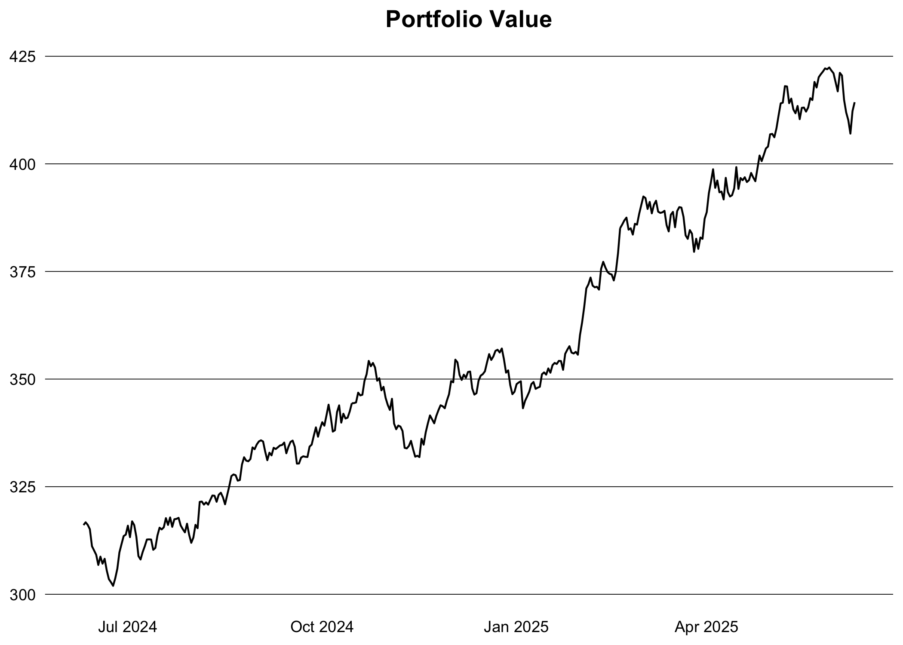
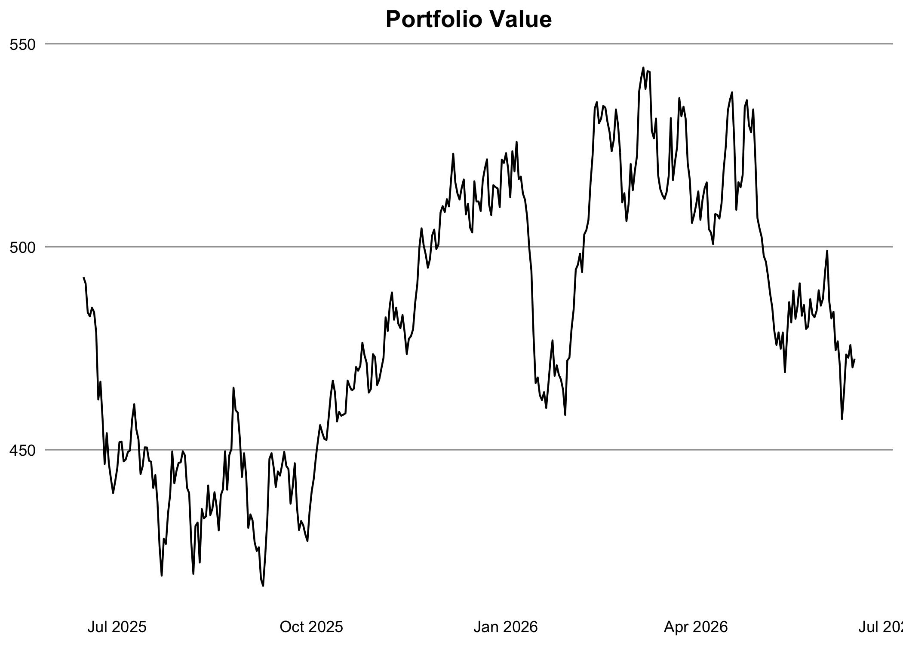
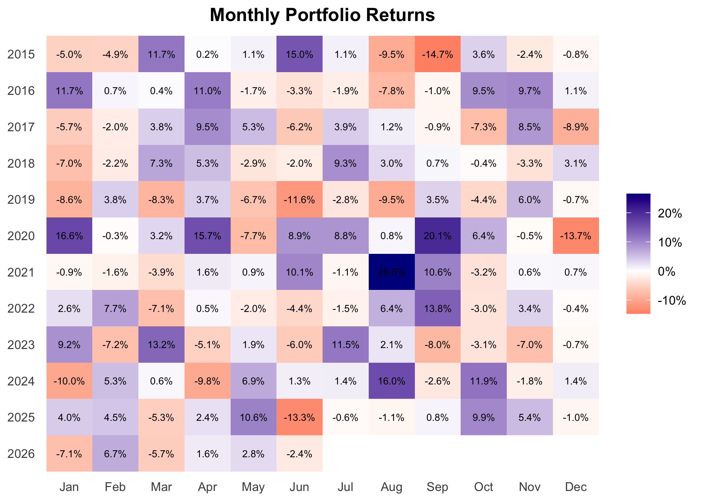
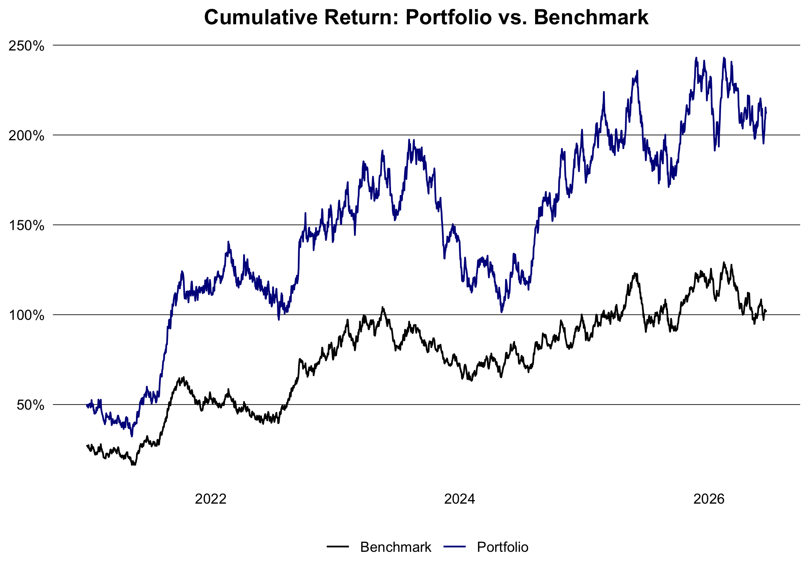
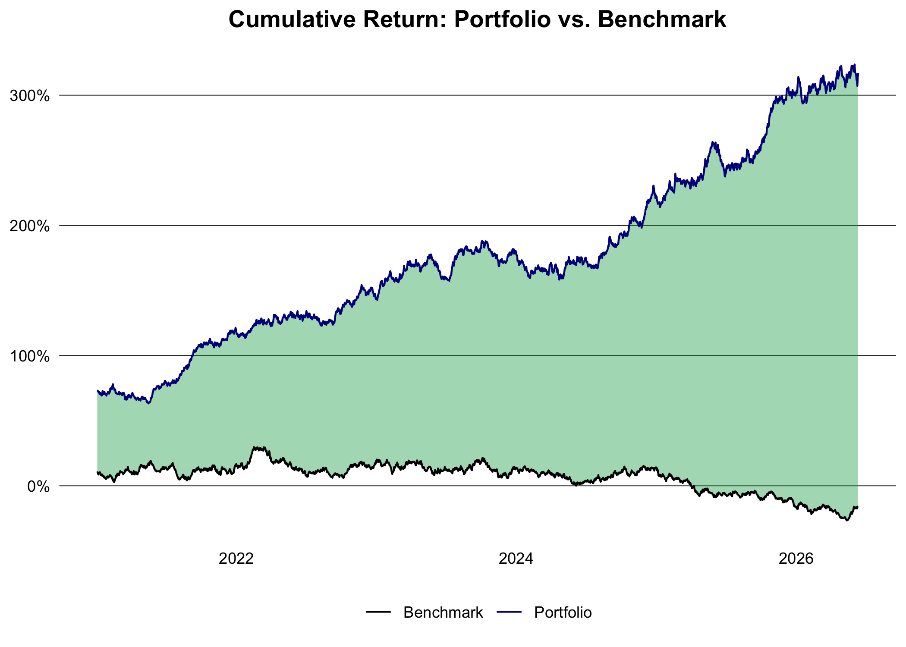
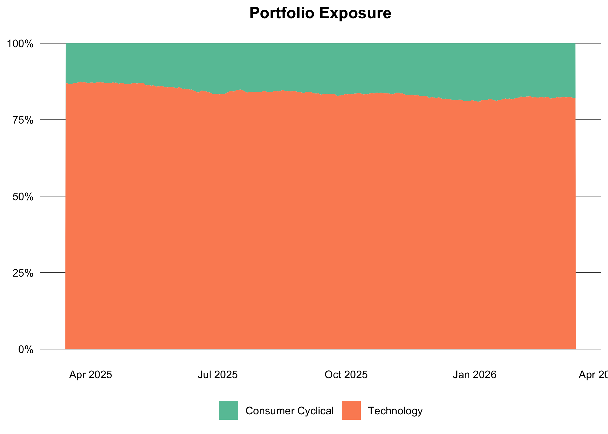
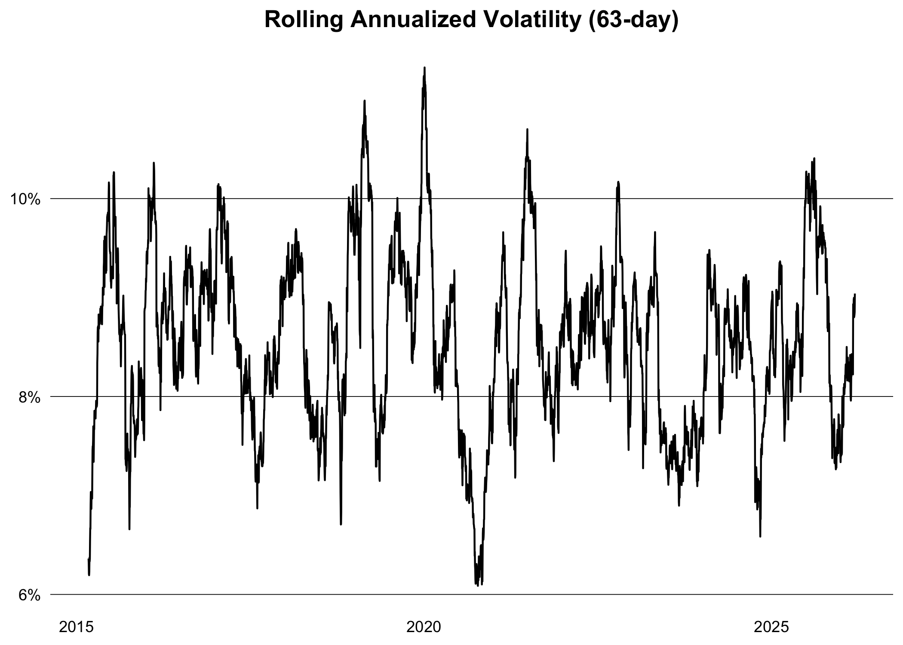
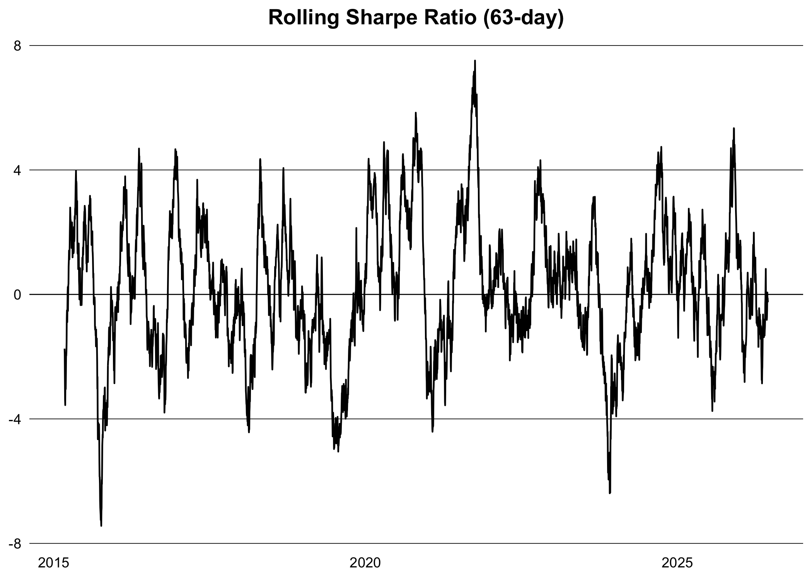
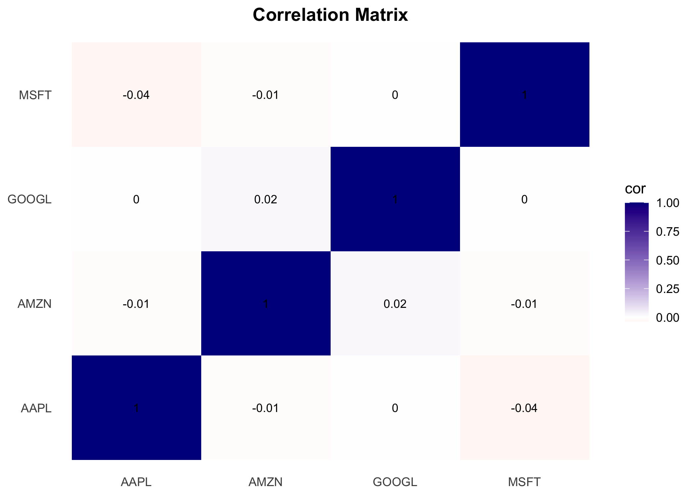
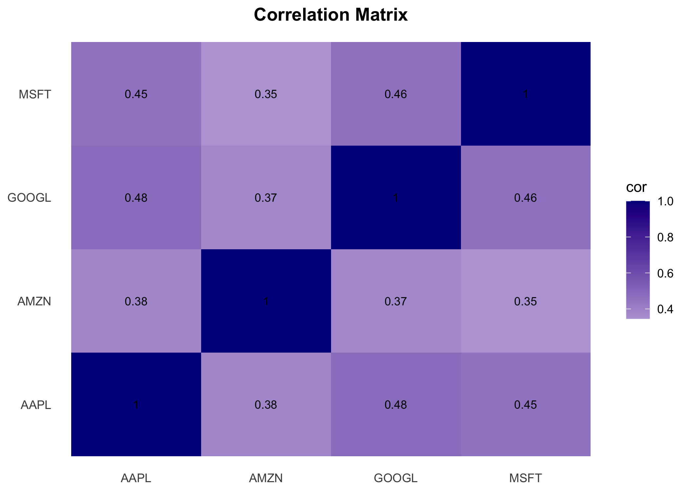

# Finance with {data.table}


Just a place to store some code snippets and notes on finance with using
the latest `data.table` package. Requires `data.table >= 1.18.0`.

Load the required libraries:

``` r
library(clock)
library(data.table)
library(ggplot2)

theme_finance = theme_minimal() +
  theme(
    plot.title = element_text(face = "bold", hjust = 0.5),
    panel.grid.major.y = element_line(color = "black", linewidth = 0.2),
    panel.grid.major.x = element_blank(),
    panel.grid.minor = element_blank(),
    axis.text = element_text(color = "black"),
    axis.title = element_blank(),
    legend.title = element_blank()
  )
```

## Portfolio Management

#### Generate data

Generate some fake stock prices for a few tickers.

``` r
set.seed(1994)

start_date = "2015-01-01"
end_date = Sys.Date()
dates = seq(as.Date(start_date), end_date, by = "1 day")
n = length(dates)

market_ret = rnorm(n, mean = 0.0003, sd = 0.008)
sector_ret = list(
  technology = rnorm(n, mean = 0, sd = 0.004),
  consumer_cyclical = rnorm(n, mean = 0, sd = 0.005)
)

alloc = data.table(
  ticker = c("AAPL", "GOOGL", "MSFT", "AMZN"),
  weight = c(0.4, 0.3, 0.2, 0.1),
  sector = c("technology", "technology", "technology", "consumer_cyclical"),
  country = c("USA", "USA", "USA", "USA"),
  alpha = c(0.0004, 0.0002, 0.0003, 0.0001),
  beta = c(1.1, 1.3, 0.9, 1.4),
  idio_sd = c(0.010, 0.012, 0.009, 0.014)
)

generate_prices = function(alpha, beta, sector, idio_sd) {
  ret = alpha + beta * market_ret + sector_ret[[sector]] + rnorm(n, sd = idio_sd)
  data.table(date = dates, price = cumprod(1 + ret) * 100)
}

generate_benchmark = function() {
  data.table(ticker = "SP500", date = dates, price = cumprod(1 + market_ret) * 3000)
}

dt = alloc |>
  _[, generate_prices(alpha, beta, sector, idio_sd), by = ticker] |>
  _[alloc[, .(ticker, weight, sector, country)], on = "ticker"]
head(dt)
```

       ticker       date     price weight     sector country
       <char>     <Date>     <num>  <num>     <char>  <char>
    1:   AAPL 2015-01-01  99.47736    0.4 technology     USA
    2:   AAPL 2015-01-02  99.47069    0.4 technology     USA
    3:   AAPL 2015-01-03 101.97927    0.4 technology     USA
    4:   AAPL 2015-01-04 101.97867    0.4 technology     USA
    5:   AAPL 2015-01-05 102.67212    0.4 technology     USA
    6:   AAPL 2015-01-06 100.72686    0.4 technology     USA

#### Holdings

``` r
holdings = dt |>
  _[,
    .(start_price = first(price), current_price = last(price), weight = first(weight)),
    by = ticker
  ] |>
  _[, let(
    value = current_price * weight,
    abs_change = current_price - start_price,
    rel_change = current_price / start_price - 1
  )] |>
  _[, rel_weight := value / sum(value)]
head(holdings)
```

       ticker start_price current_price weight     value abs_change rel_change
       <char>       <num>         <num>  <num>     <num>      <num>      <num>
    1:   AAPL    99.47736     468.68393    0.4 187.47357  369.20657  3.7114635
    2:  GOOGL   100.24577      34.63296    0.3  10.38989  -65.61281 -0.6545195
    3:   MSFT    98.36527     620.52420    0.2 124.10484  522.15893  5.3083671
    4:   AMZN    97.75700    1505.00673    0.1 150.50067 1407.24973 14.3953859
       rel_weight
            <num>
    1: 0.39679552
    2: 0.02199062
    3: 0.26267300
    4: 0.31854086

#### Portfolio Composition

``` r
ggplot(holdings, aes(x = "", y = rel_weight, fill = ticker)) +
  geom_col(width = 1) +
  coord_polar(theta = "y") +
  geom_text(
    aes(label = scales::percent(rel_weight, accuracy = 0.1)),
    position = position_stack(vjust = 0.5)
  ) +
  scale_fill_brewer(palette = "Set2") +
  labs(title = "Portfolio Composition") +
  theme_void() +
  theme(
    plot.title = element_text(face = "bold", hjust = 0.5),
    legend.title = element_blank()
  )
```



#### Calculate returns

``` r
logret = function(x) {
  x = log(x)
  x - shift(x)
}

dt = dt |>
  setorder(ticker, date) |>
  _[, let(ret = price / shift(price) - 1, log_ret = logret(price)), by = ticker] |>
  na.omit("ret") |>
  _[, let(wret = ret * weight, value = price * weight)]
head(dt)
```

       ticker       date     price weight     sector country           ret
       <char>     <Date>     <num>  <num>     <char>  <char>         <num>
    1:   AAPL 2015-01-02  99.47069    0.4 technology     USA -6.698588e-05
    2:   AAPL 2015-01-03 101.97927    0.4 technology     USA  2.521930e-02
    3:   AAPL 2015-01-04 101.97867    0.4 technology     USA -5.865964e-06
    4:   AAPL 2015-01-05 102.67212    0.4 technology     USA  6.799941e-03
    5:   AAPL 2015-01-06 100.72686    0.4 technology     USA -1.894640e-02
    6:   AAPL 2015-01-07 102.37067    0.4 technology     USA  1.631949e-02
             log_ret          wret    value
               <num>         <num>    <num>
    1: -6.698812e-05 -2.679435e-05 39.78828
    2:  2.490654e-02  1.008772e-02 40.79171
    3: -5.865981e-06 -2.346386e-06 40.79147
    4:  6.776926e-03  2.719976e-03 41.06885
    5: -1.912818e-02 -7.578559e-03 40.29074
    6:  1.618776e-02  6.527795e-03 40.94827

``` r
dt |>
  _[date >= add_months(end_date, -12L), .(value = sum(value)), by = date] |>
  ggplot(aes(x = date, y = value)) +
  geom_line() +
  theme_finance +
  labs(title = "Portfolio Value")
```



#### Calculate weekly, monthly and yearly returns

Return for each instrument:

``` r
ret_week = dt[, .(ret = prod(1 + ret) - 1), by = .(ticker, isoyear(date), isoweek(date))]
ret_month = dt[, .(ret = prod(1 + ret) - 1), by = .(ticker, yearmon(date))]
ret_year = dt[, .(ret = prod(1 + ret) - 1), by = .(ticker, year(date))]
head(ret_year)
```

       ticker  year        ret
       <char> <int>      <num>
    1:   AAPL  2015 -0.1137879
    2:   AAPL  2016  0.3133051
    3:   AAPL  2017 -0.0882069
    4:   AAPL  2018  0.3208711
    5:   AAPL  2019 -0.2739272
    6:   AAPL  2020  0.7779436

Return for the portfolio:

``` r
port_daily = dt[, .(ret = sum(wret)), by = date]
port_ret_week = port_daily[, .(ret = prod(1 + ret) - 1), by = .(isoyear(date), isoweek(date))]
port_ret_month = port_daily[, .(ret = prod(1 + ret) - 1), by = .(yearmon(date))]
port_ret_year = port_daily[, .(ret = prod(1 + ret) - 1), by = year(date)]
head(port_ret_year)
```

        year         ret
       <int>       <num>
    1:  2015 -0.06276146
    2:  2016  0.29736185
    3:  2017 -0.01610340
    4:  2018  0.10483460
    5:  2019 -0.31876358
    6:  2020  0.72887222

#### Monthly return heatmap

``` r
port_ret_month_dt = port_daily[,
  .(ret = prod(1 + ret) - 1),
  by = .(year = year(date), month = month(date))
]

ggplot(
  port_ret_month_dt,
  aes(x = fctr(month), y = fctr(year, rev = TRUE), fill = ret)
) +
  geom_tile() +
  geom_text(aes(label = scales::percent(ret, accuracy = 0.1)), size = 2.5) +
  scale_fill_gradient2(
    low = "#FF0000",
    mid = "white",
    high = "darkblue",
    midpoint = 0,
    labels = scales::label_percent()
  ) +
  scale_x_discrete(labels = month.abb) +
  labs(title = "Monthly Portfolio Returns") +
  theme_minimal() +
  theme(
    plot.title = element_text(face = "bold", hjust = 0.5),
    axis.title = element_blank(),
    panel.grid = element_blank(),
    legend.title = element_blank()
  )
```



#### Compare performance with a benchmark

Calculate the benchmark return:

``` r
bmr = generate_benchmark() |>
  setorder(date) |>
  _[, ret := price / shift(price) - 1] |>
  na.omit("ret")

port = dt |>
  _[, .(ret = sum(wret), ticker = "Portfolio"), by = date] |>
  rbind(bmr[, .(ticker, date, ret)]) |>
  setorder(ticker, date) |>
  _[, cum_ret := cumprod(1 + ret) - 1, by = ticker] |>
  _[, ticker := fifelse(ticker == "Portfolio", ticker, "Benchmark")]
```

Compare the portfolio with the benchmark performance:

``` r
port |>
  _[date > "2021-01-01"] |>
  ggplot(aes(x = date, y = cum_ret, color = ticker)) +
  geom_line() +
  theme_finance +
  theme(legend.position = "bottom") +
  scale_color_manual(values = c("Portfolio" = "darkblue", "Benchmark" = "black")) +
  scale_y_continuous(labels = scales::label_percent(accuracy = 1)) +
  labs(title = "Cumulative Return: Portfolio vs. Benchmark")
```



Or turn it into a wide-format and display the performance as an area
chart:

``` r
perf = port |>
  dcast(date ~ ticker, value.var = "cum_ret") |>
  setnames(tolower) |>
  _[, diff := portfolio - benchmark]

perf |>
  _[date > "2021-01-01"] |>
  ggplot(aes(x = date)) +
  geom_ribbon(
    aes(
      ymin = pmin(portfolio, benchmark),
      ymax = pmax(portfolio, benchmark),
      fill = diff > 0
    ),
    alpha = 0.4,
    show.legend = FALSE
  ) +
  geom_line(aes(y = portfolio, color = "Portfolio")) +
  geom_line(aes(y = benchmark, color = "Benchmark")) +
  scale_color_manual(values = c("Portfolio" = "darkblue", "Benchmark" = "black")) +
  scale_fill_manual(values = c("TRUE" = "#00A651", "FALSE" = "#FF0000")) +
  scale_y_continuous(labels = scales::label_percent(accuracy = 1L)) +
  labs(title = "Cumulative Return: Portfolio vs. Benchmark") +
  theme_finance +
  theme(legend.position = "bottom")
```



#### Analyse the portfolio exposure

``` r
exposure = dt |>
  _[, .(value = sum(value)), by = .(date, sector)] |>
  _[, weight := value / sum(value), by = date]
head(exposure)
```

             date     sector    value    weight
           <Date>     <char>    <num>     <num>
    1: 2015-01-02 technology 90.14190 0.9009292
    2: 2015-01-03 technology 92.02887 0.8985794
    3: 2015-01-04 technology 93.36167 0.9004728
    4: 2015-01-05 technology 93.81975 0.9007150
    5: 2015-01-06 technology 93.03513 0.9014982
    6: 2015-01-07 technology 94.00122 0.9016562

Exposure by sector over time:

``` r
exposure |>
  _[date >= add_months(end_date, -12L)] |>
  ggplot(aes(x = date, y = weight, fill = sector)) +
  geom_area() +
  scale_y_continuous(labels = scales::label_percent()) +
  scale_fill_brewer(palette = "Set2") +
  labs(title = "Portfolio Exposure") +
  theme_finance +
  theme(legend.position = "bottom")
```



#### Calculate volatility

Note this is scaling volatility by $\sqrt{h}$, which has some
shortcomings, see for example [Diebold et.al.
(1996)](https://www.sas.upenn.edu/~fdiebold/papers/paper18/dsi.pdf).

``` r
vola = dt |>
  _[, .(daily_vola = sd(log_ret)), by = .(ticker, year(date))] |>
  _[, let(
    weekly_vola = daily_vola * sqrt(5),
    monthly_vola = daily_vola * sqrt(21),
    yearly_vola = daily_vola * sqrt(252)
  )]
head(vola)
```

       ticker  year daily_vola weekly_vola monthly_vola yearly_vola
       <char> <int>      <num>       <num>        <num>       <num>
    1:   AAPL  2015 0.01444360  0.03229687   0.06618890   0.2292851
    2:   AAPL  2016 0.01456959  0.03257860   0.06676626   0.2312851
    3:   AAPL  2017 0.01343705  0.03004617   0.06157632   0.2133066
    4:   AAPL  2018 0.01399629  0.03129666   0.06413907   0.2221843
    5:   AAPL  2019 0.01313848  0.02937853   0.06020808   0.2085669
    6:   AAPL  2020 0.01387443  0.03102418   0.06358064   0.2202498

#### Rolling volatility

``` r
window = 63L # ~3 months
port_daily[, roll_vola := frollsd(ret, window) * sqrt(252)]

port_daily |>
  na.omit("roll_vola") |>
  ggplot(aes(x = date, y = roll_vola)) +
  geom_line() +
  scale_y_continuous(labels = scales::label_percent()) +
  labs(title = "Rolling Annualized Volatility (63-day)") +
  theme_finance
```



#### Sharpe ratio

The Sharpe ratio measures risk-adjusted return:

$$S = \frac{R_p - R_f}{\sigma_p}$$

``` r
rf = 0.04 / 252 # daily risk-free rate (assuming 4% annual)
sharpe = port_daily[, (mean(ret) - rf) / sd(ret) * sqrt(252)]
sharpe
```

    [1] 0.2447972

#### Sortino ratio

The Sortino ratio replaces total volatility with downside deviation:

$$So = \frac{R_p - R_f}{\sigma_d}$$

``` r
sortino = port_daily[, (mean(ret) - rf) / sqrt(mean(pmin(ret - rf, 0)^2)) * sqrt(252)]
sortino
```

    [1] 0.3549463

#### Rolling Sharpe

``` r
port_daily[, roll_sharpe := (frollmean(ret, window) - rf) / frollsd(ret, window) * sqrt(252)]

port_daily |>
  na.omit("roll_sharpe") |>
  ggplot(aes(x = date, y = roll_sharpe)) +
  geom_line() +
  geom_hline(yintercept = 0, linewidth = 0.3) +
  labs(title = "Rolling Sharpe Ratio (63-day)") +
  theme_finance
```



#### Value at Risk

Historical VaR at the 95% and 99% confidence levels:

``` r
port_daily[, .(VaR_95 = quantile(ret, 0.05), VaR_99 = quantile(ret, 0.01))]
```

            VaR_95      VaR_99
             <num>       <num>
    1: -0.01859053 -0.02503754

#### Expected Shortfall (CVaR)

Average loss beyond VaR:

``` r
port_daily[, .(
  CVaR_95 = mean(ret[ret <= quantile(ret, 0.05)]),
  CVaR_99 = mean(ret[ret <= quantile(ret, 0.01)])
)]
```

           CVaR_95    CVaR_99
             <num>      <num>
    1: -0.02295057 -0.0294094

#### Portfolio risk

Portfolio risk is defined as:

$$\sigma_p = \sqrt{w^T \Sigma w}$$

``` r
cov_mat = dt |>
  dcast(date ~ ticker, value.var = "log_ret") |>
  _[, date := NULL] |>
  cov(use = "pairwise.complete.obs")
wgt = alloc[colnames(cov_mat), weight, on = "ticker"]
port_risk = as.numeric(sqrt(t(wgt) %*% cov_mat %*% wgt))
port_risk
```

    [1] 0.01165301

#### Drawdown

Maximum Drawdown is defined as follows:

$$MDD = \max_{i \leq j} \left( \frac{V_i - V_j}{V_i} \right)$$

Instrument drawdown:

``` r
drawdown = copy(dt) |>
  _[, cum_ret := cumprod(1 + ret) - 1, by = ticker] |>
  _[, drawdown := (1 + cum_ret) / cummax(1 + cum_ret) - 1, by = ticker]
head(drawdown)
```

       ticker       date     price weight     sector country           ret
       <char>     <Date>     <num>  <num>     <char>  <char>         <num>
    1:   AAPL 2015-01-02  99.47069    0.4 technology     USA -6.698588e-05
    2:   AAPL 2015-01-03 101.97927    0.4 technology     USA  2.521930e-02
    3:   AAPL 2015-01-04 101.97867    0.4 technology     USA -5.865964e-06
    4:   AAPL 2015-01-05 102.67212    0.4 technology     USA  6.799941e-03
    5:   AAPL 2015-01-06 100.72686    0.4 technology     USA -1.894640e-02
    6:   AAPL 2015-01-07 102.37067    0.4 technology     USA  1.631949e-02
             log_ret          wret    value       cum_ret      drawdown
               <num>         <num>    <num>         <num>         <num>
    1: -6.698812e-05 -2.679435e-05 39.78828 -6.698588e-05  0.000000e+00
    2:  2.490654e-02  1.008772e-02 40.79171  2.515062e-02  0.000000e+00
    3: -5.865981e-06 -2.346386e-06 40.79147  2.514461e-02 -5.865964e-06
    4:  6.776926e-03  2.719976e-03 41.06885  3.211553e-02  0.000000e+00
    5: -1.912818e-02 -7.578559e-03 40.29074  1.256066e-02 -1.894640e-02
    6:  1.618776e-02  6.527795e-03 40.94827  2.908513e-02 -2.936105e-03

Portfolio drawdown:

``` r
drawdown = dt |>
  _[, .(wret = sum(wret)), by = date] |>
  _[, cum_ret := cumprod(1 + wret) - 1] |>
  _[, drawdown := (1 + cum_ret) / cummax(1 + cum_ret) - 1]
head(drawdown)
```

             date         wret     cum_ret     drawdown
           <Date>        <num>       <num>        <num>
    1: 2015-01-02  0.007441747 0.007441747  0.000000000
    2: 2015-01-03  0.023574598 0.031191782  0.000000000
    3: 2015-01-04  0.012101326 0.043670570  0.000000000
    4: 2015-01-05  0.004769576 0.048648436  0.000000000
    5: 2015-01-06 -0.009633596 0.038546181 -0.009633596
    6: 2015-01-07  0.010628405 0.049584270  0.000000000

``` r
drawdown[drawdown < 0, .(min_drawdown = min(drawdown), avg_drawdown = mean(drawdown))]
```

       min_drawdown avg_drawdown
              <num>        <num>
    1:    -0.413378   -0.1203853

#### Calmar ratio

Annualized return divided by maximum drawdown:

``` r
calmar = port_daily[, (mean(ret) * 252) / abs(drawdown[, min(drawdown)])]
calmar
```

    [1] 0.2063691

#### Tracking error

Tracking error measures how closely a portfolio follows its benchmark:

$$TE = \sqrt{\frac{1}{N-1} \sum_{i=1}^{N} (r_{p,i} - r_{b,i})^2}$$

``` r
te = dt |>
  _[, .(port_ret = sum(wret)), by = date] |>
  _[bmr[, .(date, bmr_ret = ret)], on = "date", nomatch = NULL] |>
  _[, diff := port_ret - bmr_ret]

te[, .(
  daily_te = sd(diff),
  annual_te = sd(diff) * sqrt(252)
)]
```

          daily_te annual_te
             <num>     <num>
    1: 0.007004211 0.1111884

#### Information ratio

Excess return per unit of tracking error:

``` r
te[, mean(diff) / sd(diff) * sqrt(252)]
```

    [1] 0.3124084

#### Beta and Alpha

Beta measures the portfolio’s sensitivity to the benchmark, Alpha the
excess return:

$$r_p = \alpha + \beta \cdot r_b + \epsilon$$

``` r
fit = te[, lm(port_ret ~ bmr_ret)]
coefs = coef(fit)
data.table(alpha = coefs[1L] * 252, beta = coefs[2L])
```

            alpha     beta
            <num>    <num>
    1: 0.02587615 1.175196

#### Multi-factor model

The single-factor model above explains returns with the benchmark alone.
Each instrument is in fact driven by a common market factor plus a
sector factor, so we can regress every ticker on both and recover its
factor loadings. Assemble the factors and reshape them to long form,
then match each ticker to its own sector factor with a join on `date`
and `sector`:

``` r
factors = data.table(
  date = dates,
  mkt = market_ret,
  technology = sector_ret$technology,
  consumer_cyclical = sector_ret$consumer_cyclical
) |>
  melt(id.vars = c("date", "mkt"), variable.name = "sector", value.name = "sec_ret") |>
  _[, sector := as.character(sector)]

reg = factors[dt, on = .(date, sector), nomatch = NULL]
```

Run one regression per ticker and compare the recovered market beta with
the value that was used to generate the data:

``` r
loadings = reg[, as.list(coef(lm(ret ~ mkt + sec_ret))), by = ticker] |>
  setnames(c("ticker", "alpha", "mkt_beta", "sector_beta")) |>
  _[, alpha := alpha * 252]
loadings[alloc, on = "ticker", true_beta := i.beta]
loadings
```

       ticker       alpha  mkt_beta sector_beta true_beta
       <char>       <num>     <num>       <num>     <num>
    1:   AAPL  0.09721931 1.1368851   1.0206042       1.1
    2:   AMZN  0.13186184 1.3997164   0.9847375       1.4
    3:  GOOGL -0.06004923 1.3038798   1.0267476       1.3
    4:   MSFT  0.12166385 0.9063013   1.0575958       0.9

#### Rolling market beta

Beta is not static. Estimate it over a rolling window from the ratio of
the rolling covariance with the market to the market variance:

``` r
reg |>
  setorder(ticker, date) |>
  _[, let(
    cov_rm = frollmean(ret * mkt, window) - frollmean(ret, window) * frollmean(mkt, window),
    var_m = frollmean(mkt^2, window) - frollmean(mkt, window)^2
  ), by = ticker] |>
  _[, roll_beta := cov_rm / var_m] |>
  na.omit("roll_beta") |>
  ggplot(aes(x = date, y = roll_beta, color = ticker)) +
  geom_line() +
  scale_color_brewer(palette = "Set2") +
  labs(title = "Rolling Market Beta (63-day)") +
  theme_finance +
  theme(legend.position = "bottom")
```



#### Correlation matrix

``` r
cor_mat = dt |>
  dcast(date ~ ticker, value.var = "log_ret") |>
  _[, date := NULL] |>
  cor(use = "pairwise.complete.obs")
round(cor_mat, 3)
```

           AAPL  AMZN GOOGL  MSFT
    AAPL  1.000 0.393 0.484 0.476
    AMZN  0.393 1.000 0.376 0.366
    GOOGL 0.484 0.376 1.000 0.461
    MSFT  0.476 0.366 0.461 1.000

``` r
cor_dt = as.data.table(cor_mat, keep.rownames = "ticker1") |>
  melt(id.vars = "ticker1", variable.name = "ticker2", value.name = "cor")

ggplot(cor_dt, aes(x = ticker1, y = ticker2, fill = cor)) +
  geom_tile() +
  geom_text(aes(label = round(cor, 2)), size = 3) +
  scale_fill_gradient2(low = "#FF0000", mid = "white", high = "darkblue", midpoint = 0) +
  labs(title = "Correlation Matrix") +
  theme_minimal() +
  theme(
    plot.title = element_text(face = "bold", hjust = 0.5),
    axis.title = element_blank(),
    panel.grid = element_blank()
  )
```


