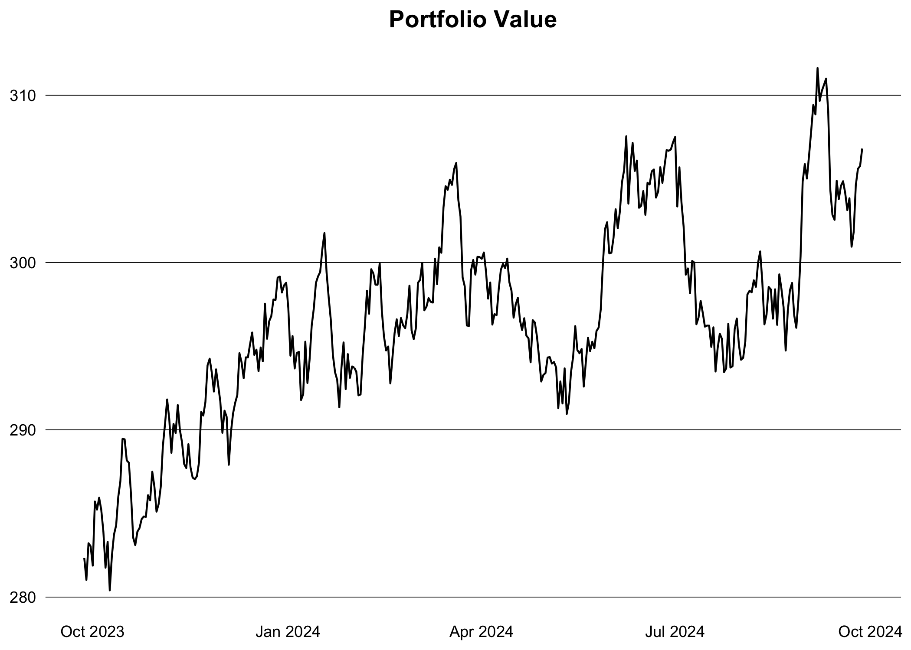

# Finance with data.table

Just a place to store some code snippets and notes on finance with using
the latest `data.table` package.

Load the required libraries:

``` r
library(clock)
library(data.table)
library(ggplot2)
```

## Portfolio Management

#### Generate data

Generate some fake stock prices for a few tickers.

``` r
set.seed(1994L)

generate_prices <- function(ticker, start_date, end_date) {
  dates <- seq.Date(as.Date(start_date), as.Date(end_date), by = "days")
  n <- length(dates)
  prices <- cumprod(1 + rnorm(n, mean = 0.0005, sd = 0.01)) * 100
  data.table(
    ticker = ticker,
    date = dates,
    price = prices
  )
}

generate_benchmark <- function(start_date, end_date) {
  dates <- seq.Date(as.Date(start_date), as.Date(end_date), by = "days")
  n <- length(dates)
  prices <- cumprod(1 + rnorm(n, mean = 0.0003, sd = 0.008)) * 3000
  data.table(
    ticker = "SP500",
    date = dates,
    price = prices
  )
}

ticker <- c("AAPL", "GOOGL", "MSFT", "AMZN")
start_date <- "2015-01-01"
end_date <- Sys.Date()

dt <- lapply(ticker, generate_prices, start_date, end_date) |> rbindlist()
alloc <- data.table(
  ticker = ticker,
  weight = c(0.4, 0.3, 0.2, 0.1),
  country = c("USA", "USA", "USA", "USA")
)
dt <- dt[alloc, on = "ticker"]
head(dt)
```

       ticker       date     price weight country
       <char>     <Date>     <num>  <num>  <char>
    1:   AAPL 2015-01-01  98.76269    0.4     USA
    2:   AAPL 2015-01-02  99.09730    0.4     USA
    3:   AAPL 2015-01-03 100.83187    0.4     USA
    4:   AAPL 2015-01-04 102.29253    0.4     USA
    5:   AAPL 2015-01-05 102.44505    0.4     USA
    6:   AAPL 2015-01-06 101.12377    0.4     USA

TODO: holdings table current date: name, total value, abs. and relative
change in value (from start), relative weight TODO: doughnut chart of
portfolio composition

#### Calculate returns

``` r
logret <- function(x) {
  x <- log(x)
  x - shift(x)
}

dt <- dt |>
  setorder(ticker, date) |>
  _[, let(ret = price / shift(price) - 1, log_ret = logret(price)), by = ticker] |>
  na.omit("ret") |>
  _[, let(wret = ret * weight, value = price * weight)]
head(dt)
```

       ticker       date    price weight country          ret      log_ret
       <char>     <Date>    <num>  <num>  <char>        <num>        <num>
    1:   AAPL 2015-01-02  99.0973    0.4     USA  0.003388113  0.003382387
    2:   AAPL 2015-01-03 100.8319    0.4     USA  0.017503699  0.017352273
    3:   AAPL 2015-01-04 102.2925    0.4     USA  0.014486079  0.014382158
    4:   AAPL 2015-01-05 102.4451    0.4     USA  0.001491033  0.001489923
    5:   AAPL 2015-01-06 101.1238    0.4     USA -0.012897486 -0.012981380
    6:   AAPL 2015-01-07 101.9909    0.4     USA  0.008575100  0.008538542
                wret    value
               <num>    <num>
    1:  0.0013552454 39.63892
    2:  0.0070014795 40.33275
    3:  0.0057944315 40.91701
    4:  0.0005964132 40.97802
    5: -0.0051589943 40.44951
    6:  0.0034300399 40.79637

``` r
dt |>
  _[date >= add_months(end_date, -12L), .(value = sum(value)), by = date] |>
  ggplot(aes(x = date, y = value)) +
  geom_line() +
  theme_minimal() +
  theme(
    plot.title = element_text(face = "bold", hjust = 0.5),
    panel.grid.major.y = element_line(color = "black", linewidth = 0.2),
    panel.grid.major.x = element_blank(),
    panel.grid.minor = element_blank(),
    axis.text = element_text(color = "black"),
    axis.title = element_blank()
  ) +
  labs(title = "Portfolio Value")
```



#### Calculate weekly, monthly and yearly returns

Return for each instrument:

``` r
ret_week <- dt[, .(ret = prod(1 + ret) - 1), by = .(ticker, year(date), week(date))]
ret_month <- dt[, .(ret = prod(1 + ret) - 1), by = .(ticker, yearmon(date))]
ret_year <- dt[, .(ret = prod(1 + ret) - 1), by = .(ticker, year(date))]
head(ret_year)
```

       ticker  year         ret
       <char> <int>       <num>
    1:   AAPL  2015  0.16949691
    2:   AAPL  2016  0.13929434
    3:   AAPL  2017  0.05661279
    4:   AAPL  2018  0.21636018
    5:   AAPL  2019 -0.29360467
    6:   AAPL  2020  0.43077795

Return for the portfolio:

``` r
port_ret_week <- dt[, .(ret = prod(1 + wret) - 1), by = .(year(date), week(date))]
port_ret_month <- dt[, .(ret = prod(1 + wret) - 1), by = .(yearmon(date))]
port_ret_year <- dt[, .(ret = prod(1 + wret) - 1), by = year(date)]
head(port_ret_year)
```

        year         ret
       <int>       <num>
    1:  2015  0.17716080
    2:  2016  0.20719884
    3:  2017  0.13844681
    4:  2018  0.10518440
    5:  2019 -0.16769546
    6:  2020  0.05554336

#### Compare performance with a benchmark

Calculat the benchmark return:

``` r
bmr <- generate_benchmark(start_date, end_date) |>
  setorder(date) |>
  _[, ret := price / shift(price) - 1] |>
  na.omit("ret")

port <- dt |>
  _[, .(ret = prod(1 + wret) - 1, ticker = "Portfolio"), by = date] |>
  rbind(bmr[, .(ticker, date, ret)]) |>
  setorder(ticker, date) |>
  _[, cum_ret := cumprod(1 + ret) - 1, by = ticker] |>
  _[, ticker := fifelse(ticker == "Portfolio", ticker, "Benchmark")]
```

Compare the portfolio with the benchmark performance:

``` r
port |>
  _[date > "2021-01-01"] |>
  ggplot(aes(x = date, y = cum_ret, color = ticker)) +
  geom_line() +
  theme_minimal() +
  theme(
    plot.title = element_text(face = "bold", hjust = 0.5),
    panel.grid.major.y = element_line(color = "black", linewidth = 0.2),
    panel.grid.major.x = element_blank(),
    panel.grid.minor = element_blank(),
    axis.text = element_text(color = "black"),
    axis.title = element_blank(),
    legend.title = element_blank(),
    legend.position = "bottom"
  ) +
  scale_color_manual(values = c("Portfolio" = "darkblue", "Benchmark" = "black")) +
  scale_y_continuous(labels = scales::percent_format(accuracy = 2L)) +
  labs(title = "Cumulative Return: Portfolio vs. Benchmark")
```


Or turn it into a wide-format and display the performance as an area
chart:

``` r
# TODO: remove the legend with T/F and bmr/port labels
perf <- port |>
  dcast(date ~ ticker, value.var = "cum_ret") |>
  setnames(tolower) |>
  _[, diff := portfolio - benchmark]

perf |>
  _[date > "2021-01-01"] |>
  ggplot(aes(x = date)) +
  geom_ribbon(aes(
      ymin = pmin(portfolio, benchmark),
      ymax = pmax(portfolio, benchmark),
      fill = diff > 0
    ),
    alpha = 0.4
  ) +
  geom_line(aes(y = portfolio), color = "darkblue") +
  geom_line(aes(y = benchmark), color = "black") +
  scale_fill_manual(values = c("TRUE" = "green", "FALSE" = "red")) +
  scale_y_continuous(labels = scales::percent_format(accuracy = 2L)) +
  labs(title = "Cumulative Return: Portfolio vs. Benchmark") +
  theme_minimal() +
  theme(
    plot.title = element_text(face = "bold", hjust = 0.5),
    panel.grid.major.y = element_line(color = "black", linewidth = 0.2),
    panel.grid.major.x = element_blank(),
    panel.grid.minor = element_blank(),
    axis.text = element_text(color = "black"),
    axis.title = element_blank(),
    legend.title = element_blank(),
    legend.position = "none"
  )
```


``` r
perf |>
  _[date >= "2022-01-10", .(
    benchmark = last(benchmark) - first(benchmark),
    portfolio = last(portfolio) - first(portfolio)
  ), by = .(year(date))]
```

#### Analyse the portfolio exposure

#### Calculate volatility

``` r
vola <- dt[, .(daily_vola = sd(log_ret)), by = .(ticker, year(date))] |>
  _[, let(
    weekly_vola = daily_vola * sqrt(5L),
    monthly_vola = daily_vola * sqrt(21L),
    yearly_vola = daily_vola * sqrt(252L)
  )]
head(vola)
```

       ticker  year  daily_vola weekly_vola monthly_vola yearly_vola
       <char> <int>       <num>       <num>        <num>       <num>
    1:   AAPL  2015 0.009838597  0.02199977   0.04508612   0.1561829
    2:   AAPL  2016 0.010356613  0.02315809   0.04745996   0.1644061
    3:   AAPL  2017 0.009602949  0.02147285   0.04400624   0.1524421
    4:   AAPL  2018 0.010043538  0.02245803   0.04602527   0.1594362
    5:   AAPL  2019 0.010341000  0.02312318   0.04738842   0.1641583
    6:   AAPL  2020 0.009245012  0.02067247   0.04236597   0.1467600

``` r
wgt <- alloc$weight
cov_mat <- dt |>
  dcast(date ~ ticker, value.var = "log_ret") |>
  _[, date := NULL] |>
  cov(use = "pairwise.complete.obs")
port_risk <- sqrt(t(wgt) %*% cov_mat %*% wgt)
port_risk
```

                [,1]
    [1,] 0.005453805

#### TODO:

- Max/average drawdown
- Tacking error
- Portfolio risk
