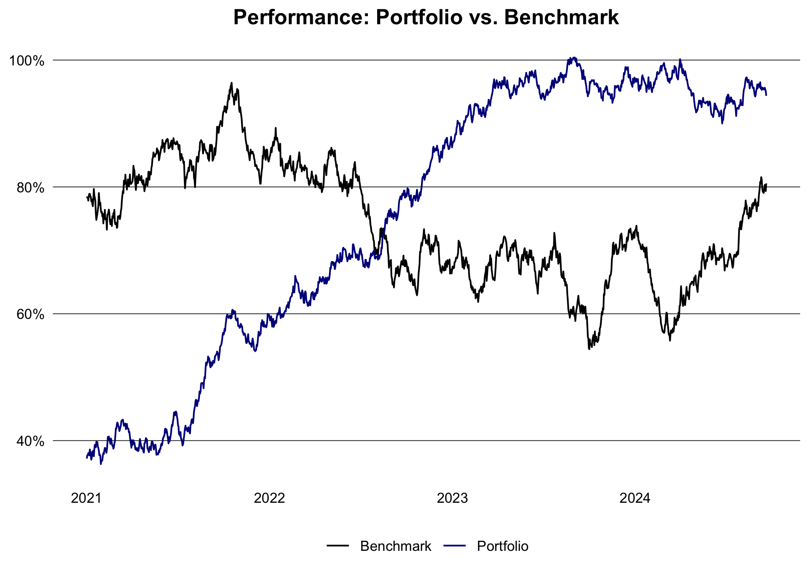

# data.table finance notes

The goal of this document is to document common financial calculations
using the `data.table` package using the latest `R >= 4.4` and
`data.table >= 1.16` syntax.

## Portfolio Management

#### Generate data

Generate some fake stock prices for a few tickers.

``` r
library(data.table)

set.seed(1994L)

generate_prices <- function(ticker, start_date, end_date) {
  dates <- seq.Date(as.Date(start_date), as.Date(end_date), by = "days")
  n <- length(dates)
  prices <- cumprod(1 + rnorm(n, mean = 0.0005, sd = 0.01)) * 100
  data.table(
    ticker = ticker,
    date = dates,
    price = prices
  )
}

generate_benchmark <- function(start_date, end_date) {
  dates <- seq.Date(as.Date(start_date), as.Date(end_date), by = "days")
  n <- length(dates)
  prices <- cumprod(1 + rnorm(n, mean = 0.0003, sd = 0.008)) * 3000
  data.table(
    ticker = "SP500",
    date = dates,
    price = prices
  )
}

ticker <- c("AAPL", "GOOGL", "MSFT", "AMZN")
start_date <- "2015-01-01"
end_date <- Sys.Date()

dt <- lapply(ticker, generate_prices, start_date, end_date) |> rbindlist()
weights <- data.table(
  ticker = ticker,
  weight = c(0.4, 0.3, 0.2, 0.1),
  country = c("USA", "USA", "USA", "USA")
)
dt <- dt[weights, on = "ticker"]
head(dt)
```

       ticker       date     price weight country
       <char>     <Date>     <num>  <num>  <char>
    1:   AAPL 2015-01-01  98.76269    0.4     USA
    2:   AAPL 2015-01-02  99.09730    0.4     USA
    3:   AAPL 2015-01-03 100.83187    0.4     USA
    4:   AAPL 2015-01-04 102.29253    0.4     USA
    5:   AAPL 2015-01-05 102.44505    0.4     USA
    6:   AAPL 2015-01-06 101.12377    0.4     USA

#### Calculate returns

In most use-cases and asset classes working with log prices is
preferred. Change the price to log prices and calculate the return.

``` r
dt <- dt |>
  setorder(ticker, date) |>
  _[, price := log(price)] |>
  _[, ret := price - shift(price), by = ticker] |>
  _[, wret := ret * weight] |>
  na.omit("ret")
head(dt)
```

       ticker       date    price weight country          ret         wret
       <char>     <Date>    <num>  <num>  <char>        <num>        <num>
    1:   AAPL 2015-01-02 4.596102    0.4     USA  0.003382387  0.001352955
    2:   AAPL 2015-01-03 4.613455    0.4     USA  0.017352273  0.006940909
    3:   AAPL 2015-01-04 4.627837    0.4     USA  0.014382158  0.005752863
    4:   AAPL 2015-01-05 4.629327    0.4     USA  0.001489923  0.000595969
    5:   AAPL 2015-01-06 4.616345    0.4     USA -0.012981380 -0.005192552
    6:   AAPL 2015-01-07 4.624884    0.4     USA  0.008538542  0.003415417

#### Calculate weekly, monthly and yearly returns

Return for each instrument:

``` r
dt[, let(week = week(date), month = month(date), year = year(date))]
ret_week <- dt[, .(ret = sum(ret)), by = .(ticker, year, week)]
ret_month <- dt[, .(ret = sum(ret)), by = .(ticker, year, month)]
ret_year <- dt[, .(ret = sum(ret)), by = .(ticker, year)]
head(ret_year)
```

       ticker  year         ret
       <char> <int>       <num>
    1:   AAPL  2015  0.15657366
    2:   AAPL  2016  0.13040908
    3:   AAPL  2017  0.05506831
    4:   AAPL  2018  0.19586294
    5:   AAPL  2019 -0.34758024
    6:   AAPL  2020  0.35821832

Return for the portfolio:

``` r
port_ret_week <- dt[, .(ret = sum(wret)), by = .(year, week)]
port_ret_month <- dt[, .(ret = sum(wret)), by = .(year, month)]
port_ret_year <- dt[, .(ret = sum(wret)), by = year]
head(port_ret_year)
```

        year         ret
       <int>       <num>
    1:  2015  0.14060793
    2:  2016  0.17495184
    3:  2017  0.11483987
    4:  2018  0.09582058
    5:  2019 -0.21623988
    6:  2020  0.03894370

#### Compare with benchmark

Calculat the benchmark return:

``` r
bmr <- generate_benchmark(start_date, end_date) |>
  setorder(date) |>
  _[, price := log(price)] |>
  _[, ret := price - shift(price)] |>
  na.omit("ret")

port <- dt |>
  _[, .(ret = sum(wret), ticker = "Portfolio"), by = date] |>
  rbind(bmr[, .(ticker, date, ret)]) |>
  setorder(ticker, date) |>
  _[, cum_ret := cumsum(ret), by = ticker] |>
  _[, ticker := fifelse(ticker == "Portfolio", ticker, "Benchmark")][]
```

Compare the portfolio with the benchmark performance:

``` r
library(ggplot2)

port |>
  _[between(date, "2021-01-01", max(date))] |>
  ggplot(aes(x = date, y = cum_ret, color = ticker)) +
  geom_line() +
  theme_minimal() +
  theme(
    plot.title = element_text(face = "bold", hjust = 0.5),
    panel.grid.major.y = element_line(color = "black", linewidth = 0.2),
    panel.grid.major.x = element_blank(),
    panel.grid.minor = element_blank(),
    axis.text = element_text(color = "black"),
    axis.title = element_blank(),
    legend.title = element_blank(),
    legend.position = "bottom"
  ) +
  scale_color_manual(values = c("Portfolio" = "darkblue", "Benchmark" = "black")) +
  scale_y_continuous(labels = scales::percent_format(accuracy = 2L)) +
  labs(title = "Performance: Portfolio vs. Benchmark")
```



Or turn it into a wide-format and display the performance as an area
chart:

``` r
# TODO: remove the legend with T/F and bmr/port labels
perf <- port |>
  dcast(date ~ ticker, value.var = "cum_ret") |>
  setnames(tolower) |>
  _[, diff := portfolio - benchmark][]

perf |>
  _[between(date, "2021-01-01", max(date))] |>
  ggplot(aes(x = date)) +
  geom_ribbon(aes(
      ymin = pmin(portfolio, benchmark),
      ymax = pmax(portfolio, benchmark),
      fill = diff > 0
    ),
    alpha = 0.4
  ) +
  geom_line(aes(y = portfolio), color = "darkblue") +
  geom_line(aes(y = benchmark), color = "black") +
  scale_fill_manual(values = c("TRUE" = "green", "FALSE" = "red")) +
  scale_y_continuous(labels = scales::percent_format(accuracy = 2L)) +
  labs(title = "Performance: Portfolio vs. Benchmark") +
  theme_minimal() +
  theme(
    plot.title = element_text(face = "bold", hjust = 0.5),
    panel.grid.major.y = element_line(color = "black", linewidth = 0.2),
    panel.grid.major.x = element_blank(),
    panel.grid.minor = element_blank(),
    axis.text = element_text(color = "black"),
    axis.title = element_blank(),
    legend.title = element_blank()
  )
```


#### Analyse the portfolio exposure

#### Calculate volatility

``` r
vola <- dt[, .(daily_vola = sd(ret)), by = .(ticker, year)] |>
  _[, let(
    weekly_vola = daily_vola * sqrt(5L),
    monthly_vola = daily_vola * sqrt(21L),
    yearly_vola = daily_vola * sqrt(252L)
  )]
head(vola)
```

       ticker  year  daily_vola weekly_vola monthly_vola yearly_vola
       <char> <int>       <num>       <num>        <num>       <num>
    1:   AAPL  2015 0.009838597  0.02199977   0.04508612   0.1561829
    2:   AAPL  2016 0.010356613  0.02315809   0.04745996   0.1644061
    3:   AAPL  2017 0.009602949  0.02147285   0.04400624   0.1524421
    4:   AAPL  2018 0.010043538  0.02245803   0.04602527   0.1594362
    5:   AAPL  2019 0.010341000  0.02312318   0.04738842   0.1641583
    6:   AAPL  2020 0.009245012  0.02067247   0.04236597   0.1467600

#### TODO:

- Max/average drawdown
- Tacking error
- Portfolio risk
